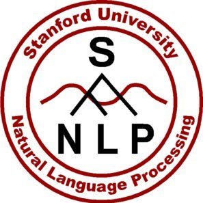

<h1 align="center">Natural Language Processing</h1>

|       |                                                   |                  |
|-------|---------------------------------------------------|------------------|
| 📱    | [**Applications**](#-applications)               |  |
| 📋    | [**Pipeline**](#-pipeline)                       |  |
| 📏    | [**Scores**](#-scores)                           |  |
| 👨🏻‍🏫 | [**Transfer Learning**](#-transfer-learning)     |  |
| 🤖    | [**Transformers theory**](#-transformers)        |  |
| 🔮    | [**DL Models**](#-deep-learning-models)          |  |
| 📦    | [**Python Packages**](#-python-packages)         |  |
 

---

# 📱 Applications

| Application                           | Description                                                               | Type |
|---------------------------------------|---------------------------------------------------------------------------|------|
| 🏷️ **Part-of-speech tagging (POS)**   | Identify if each word is a noun, verb, adjective, etc. (aka Parsing).     | 🔤 |
| 📍 **Named entity recognition (NER)** | Identify names, organizations, locations, medical codes, time, etc.        | 🔤 |
| 👦🏻❓ **Coreference Resolution**       | Identify several ocuurences on the same person/objet like he, she         | 🔤 |
| 🔍 **Text categorization**            | Identify topics present in a text (sports, politics, etc).                | 🔤 |
| ❓ **Question answering**             | Answer questions of a given text (SQuAD, DROP dataset).                    | 💭 |
| 👍🏼 👎🏼 **Sentiment analysis**          | Possitive or negative comment/review classification.                       | 💭 |
| 🔮 **Language Modeling (LM)**          | Predict the next word. Unupervised.                                       | 💭 |
| 🔮 **Masked Language Modeling (MLM)**  | Predict the omitted words. Unupervised.                                   | 💭 |
| 🔮 **Next Sentence Prediction (NSP)**  |                                                                          | 💭 |
| 📗→📄 **Summarization**                | Crate a short version of a text.                                          | 💭 |
| 🈯→🆗 **Translation**                 | Translate into a different language.                                      | 💭 |
| 🆓→🆒 **Dialogue bot**                | Interact in a conversation.                                               | 💭 |
| 💁🏻→🔠 **Speech recognition**          | Speech to text. See [AUDIO](/AUDIO.md) cheatsheet.                        | 🗣️ |
| 🔠→💁🏻 **Speech generation**           | Text to speech. See [AUDIO](/AUDIO.md) cheatsheet.                        | 🗣️ |

- 🔤: Natural Language Processing (NLP)
- 💭: Natural Language Understanding (NLU)
- 🗣️: Speech and sound (speak and listen)


# 📋 Pipeline

1. **Preprocess**
   - **Tokenization**: Split the text into sentences and the sentences into words.
   - **Lowercasing**: Usually done in **Tokenization**
   - **Punctuation removal**: Remove words like `.`, `,`, `:`. Usually done in **Tokenization**
   - **Stopwords removal**: Remove words like `and`, `the`, `him`. Done in the past. 
   - **Lemmatization**: Verbs to root form: `organizes`, `will organize` `organizing` → `organize` This is better.
   - **Stemming**: Nouns to root form: `democratic`, `democratization` → `democracy`. This is faster.
   - [**Subword tokenization**](https://medium.com/@makcedward/how-subword-helps-on-your-nlp-model-83dd1b836f46) Used in transformers. ⭐
     - **WordPiece**: Used in BERT
     - [**Byte Pair Encoding (BPE)**](https://arxiv.org/abs/1508.07909): Used in GPT-2 (2016)
     - [**Unigram Language Model**](https://arxiv.org/abs/1804.10959): (2018)
     - [**SentencePiece**](https://arxiv.org/pdf/1808.06226.pdf): (2018)
2. **Extract features**
   - **Document features**
     - **Bag of Words (BoW)**: Counts how many times a word appears in a text. (It can be normalize by text lenght)
     - **TF-IDF**: Measures relevance for each word in a document, not frequency like BoW.
     - **N-gram**: Probability of N words together.
     - Sentence and document vectors. [paper2014](https://arxiv.org/abs/1405.4053), [paper2017](https://arxiv.org/abs/1705.02364)
   - **Word features**
     - **Word Vectors**: Unique representation for every word (independent of its context).
       - [**Word2Vec**](https://arxiv.org/abs/1310.4546): By Google in 2013
       - **GloVe**: By Standford
       - **FastText**: By Facebook
     - **Contextualized Word Vectors**: Good for polysemic words (meaning depend of its context).
       - [**CoVE**](https://arxiv.org/abs/1708.00107): in 2017
       - [**ELMO**](https://arxiv.org/abs/1802.05365): Done with with bidirectional LSTMs. By allen Institute in 2018
       - **Transformer encoder**:  Done with with self-attention. ⭐
3. **Build model**
   - **Bag of Embeddings**
   - Linear algebra/matrix decomposition
     - Latent Semantic Analysis (LSA) that uses Singular Value Decomposition (SVD).
     - Non-negative Matrix Factorization (NMF)
     - Latent Dirichlet Allocation (LDA): Good for BoW
   - **Neural nets**
     - **Recurrent NNs decoder** (LSTM, GRU)
     - **Transformer decoder** (GPT, BERT, ...) ⭐
   - **Hidden Markov Models**


#### Others
- **Regular expressions**: (Regex) Find patterns.
- **Parse trees**: Syntax od a sentence


### Seq2seq
- Recurent nets
  - GRU
  - LSTM
- Tricks
  - Teacher forcing: Feed to the decoder the correct previous word, insted of the predicted previous word (at the beggining of training)
  - Attention: Learns weights to perform a weighted average of the words embeddings.


# 🤖 Transformers

### Transformer input

1. **Tokenizer**: Create subword tokens. Methods: BPE...
2. **Embedding**: Create vectors for each token. Sum of:
   - **Token Embedding**
   - **Positional Encoding**: Information about tokens order (e.g. sinusoidal function).
3. Dropout

### Transformer blocks (6, 12, 24,...)

1. Normalization
2. **Multi-head attention** layer (with a **left-to-right attention mask**)
   - Each attention head uses self attention to process each token input conditioned on the other input tokens.
   - Left-to-right attention mask ensures that only attends to the positions that precede it to the left.
3. Normalization
4. **Feed forward** layers:
   1. Linear H→4H
   2. GeLU activation func
   3. Linear 4H→H

### Transformer output

1. Normalization
2. Output embedding
3. Softmax
4. Label smothing: Ground truth -> 90% the correct word, and the rest 10% divided on the other words.


- Lowest layers: morphology
- Middle layers: syntax
- Highest layers: Task-specific semantics


# 📏 Scores

| Score          | For what?       | Description                                               | Interpretation         |
|:--------------:|:---------------:|-----------------------------------------------------------|------------------------|
| **Perplexity** | **LM**          |                                                           | The lower the better.  |
| **GLUE**       | **NLU**         | An avergae of different scores                            |                        |
| **BLEU**       | **Translation** | Compare generated with reference sentences (N-gram)       | The higher the better. |

> #### BLEU limitation
> "He ate the apple" & "He ate the potato" has the same BLEU score.


# 👨🏻‍🏫 Transfer Learning

| Step  | Task                                          | Data                                  | Who do this?           |
|:-----:|-----------------------------------------------|---------------------------------------|------------------------|
| **1** | **[Masked] Language Model Pretraining**       | 📚 Lot of text corpus (eg. Wikipedia) | 🏭 Google or Facebook |
| **2** | **[Masked] Language Model Finetunning**       | 📗 Only you domain text corpus        | 💻 You                |
| **3** | **Your supervised task (clasification, etc)** | 📗🏷️ You labeled domain text          | 💻 You                |


# 📦 Python Packages

| Packages                                         | Description                                                               | Type |
|:------------------------------------------------:|---------------------------------------------------------------------------|------|
|        | Parse trees, execelent tokenizer (8 languages)                            | 🔤 |
|       | Semantic analysis, topic modeling and similarity detection.               | 🔤 |
| <h3>NLTK</h3>                                    | Very broad NLP library. Not SotA.                                         | 🔤 |
| <h3>SentencePiece</h3>                           | Unsupervised text tokenizer by Google                                     | 🔤 |
|       | Fast.ai NLP: ULMFiT fine-tuning                                           | 🔤 |
|      | TorchText (Pytorch subpackage)                                            | 🔤 |
|     | Word vector representations and sentence classification (157 languages)   | 🔤 |
|  | pytorch-transformers: 8 pretrained Pytorch transformers                   | 🔤 |
| + | SpaCy + pytorch-transformers  | 🔤 |
| <h3>fast-bert</h3>                               | Super easy library for BERT based models                                  | 🔤 |
|  | Pretrained models for 53 languages                                        | 🔤 |
| <h3>PyText</h3>                                  |                                                                           | 🔤 |
|     | An open-source NLP research library, built on PyTorch.                    | 🔤 |
|         | Fast & easy NLP transfer learning for the industry.                       | 🔤 |
|  | NLP library designed for reproducible experimentation management.         | 🔤 |
|        | A very simple framework for state-of-the-art NLP.                         | 🔤 |
| | SotA NLP deep learning topologies and techniques.                         | 🔤 |
|     | Scikit-learn style model finetuning for NLP.                              | 🔤 |


<h1></h1>

### Installation

```bash
pip install spacy
python -m spacy download en_core_web_sm
python -m spacy download es_core_news_sm
python -m spacy download es_core_news_md
```

### Usage

```python
import spacy

nlp = spacy.load("en_core_web_sm")  # Load English small model
nlp = spacy.load("es_core_news_sm") # Load Spanish small model without Word2Vec
nlp = spacy.load('es_core_news_md') # Load Spanish medium model with Word2Vec


text = nlp("Hola, me llamo Javi")   # Text from string
text = nlp(open("file.txt").read()) # Text from file


spacy.displacy.render(text, style='ent', jupyter=True)  # Display text entities
spacy.displacy.render(text, style='dep', jupyter=True)  # Display word dependencies
```

### Word2Vect

`es_core_news_md` has 534k keys, 20k unique vectors (50 dimensions)

```python
coche = nlp("coche")
moto  = nlp("moto")
print(coche.similarity(moto)) # Similarity based on cosine distance

coche[0].vector      # Show vector
```


# 🔮 Deep learning models [ALL MODELS](https://github.com/thunlp/PLMpapers)

🤗 Means availability (pretrained PyTorch implementation) on [pytorch-transformers](https://github.com/huggingface/pytorch-transformers) package developed by huggingface.

| Model              | Creator         | Date      | Breif description                                        | Data  | 🤗 |
|:------------------:|:---------------:|:---------:|----------------------------------------------------------|-------|:---:|
| **1st Transformer**| Google          | Jun. 2017 | Encoder & decoder transformer with attention |       |     |
| **ULMFiT**         | Fast.ai         | Jan. 2018 | Regular LSTM              |       |     |
| **ELMo**           | AllenNLP        | Feb. 2018 | Bidirectional LSTM        |       |     |
| **GPT**            | OpenAI          | Jun. 2018 | Transformer on LM         |       | ✔ |
| **BERT**           | Google          | Oct. 2018 | Transformer on MLM (& NSP)| 16GB  | ✔ |
| **Transformer-XL** | Google/CMU      | Jan. 2019 |                           |       | ✔ |
| **XLM/mBERT**      | Facebook        | Jan. 2019 | Multilingual LM           |       | ✔ |
| **Transf. ELMo**   | AllenNLP        | Jan. 2019 |                           |       |   |
| **GPT-2**          | OpenAI          | Feb. 2019 | Good text generation      |       | ✔ |
| **ERNIE**          | Baidu research  | Apr. 2019 |                           |       |    |
| **XLNet**:         | Google/CMU      | Jun. 2019 | BERT + Transformer-XL               | 130GB | ✔ |
| **RoBERTa**        | Facebook        | Jul. 2019 | BERT without NSP                    | 160GB | ✔ |
| **MegatronLM**     | Nvidia          | Aug. 2019 | Big models with parallel training   |       |   |
| **DistilBERT**     | Hugging Face    | Aug. 2019 | Compressed BERT                     | 16GB  | ✔ |
| **[MiniBERT](https://arxiv.org/abs/1909.00100)**  | Google   | Aug. 2019  | Compressed BERT  |     |  |
| **[ALBERT](https://openreview.net/pdf?id=H1eA7AEtvS)** | Google   | Sep. 2019  |  Parameter reduction on BERT  |     |  |

https://huggingface.co/pytorch-transformers/pretrained_models.html

| Model              | 2L  | 3L  | 6L  | 12L  | 18L  | 24L  | 36L  |  48L  |  54L  |  72L  |
|:------------------:|:---:|:---:|:---:|:----:|:----:|:----:|:----:|:-----:|:-----:|:-----:|
| **1st Transformer**|     |     |     | yes  |      |      |      |       |       |       |
| **ULMFiT**         |     | yes |     |      |      |      |      |       |       |       |
| **ELMo**           | yes |     |     |      |      |      |      |       |       |       |
| **GPT**            |     |     |     | 110M |      |      |      |       |       |       |
| **BERT**           |     |     |     | 110M |      | 340M |      |       |       |       |
| **Transformer-XL** |     |     |     |      | 257M |      |      |       |       |       |
| **XLM/mBERT**      |     |     | Yes | Yes  |      |      |      |       |       |       |
| **Transf. ELMo**   |     |     |     |      |      |      |      |       |       |       |
| **GPT-2**          |     |     |     | 117M |      | 345M | 762M | 1542M |       |       |
| **ERNIE**          |     |     | Yes |      |      |      |      |       |       |       |
| **XLNet**:         |     |     |     | 110M |      | 340M |      |       |       |       |
| **RoBERTa**        |     |     |     | 125M |      | 355M |      |       |       |       |
| **MegatronLM**     |     |     |     |      |      | 355M |      |       | 2500M | 8300M |
| **DistilBERT**     |     |     | 66M |      |      |      |      |       |       |       |
| **MiniBERT**       |     | Yes |     |      |      |      |      |       |       |       |
  
- **Attention**: (Aug 2015)
  - Allows the network to refer back to the input sequence, instead of forcing it to encode all information into ane fixed-lenght vector.
  - Paper: [Effective Approaches to Attention-based Neural Machine Translation](https://arxiv.org/abs/1508.04025)
  - [blog](https://jalammar.github.io/visualizing-neural-machine-translation-mechanics-of-seq2seq-models-with-attention/)
  - [attention and memory](http://www.wildml.com/2016/01/attention-and-memory-in-deep-learning-and-nlp/)
- **1st Transformer**: (Google AI, jun. 2017)
  - Introduces the transformer architecture: Encoder with self-attention, and decoder with attention.
  - Surpassed RNN's State of the Art
  - Paper: [Attention Is All You Need](https://arxiv.org/abs/1706.03762)
  - [blog](https://jalammar.github.io/illustrated-transformer).
- **ULMFiT**: (Fast.ai, Jan. 2018)
  - Regular LSTM Encoder-Decoder architecture with no attention.
  - Introduces the idea of transfer-learning in NLP:
    1. Take a trained tanguge model: Predict wich word comes next. Trained with Wikipedia corpus for example (Wikitext 103).
    2. Retrain it with your corpus data
    3. Train your task (classification, etc.)
  - Paper: [Universal Language Model Fine-tuning for Text Classification](https://arxiv.org/abs/1801.06146)
- **ELMo**: (AllenNLP, Feb. 2018)
  - Context-aware embedding = better representation. Useful for synonyms.
  - Made with bidirectional LSTMs trained on a language modeling (LM) objective.
  - Parameters: 94 millions
  - Paper: [Deep contextualized word representations](https://arxiv.org/abs/1802.05365)
  - [site](https://allennlp.org/elmo).
- **GPT**: (OpenAI, Jun. 2018)
  - Made with transformer trained on a language modeling (LM) objective.
  - Same as transformer, but with transfer-learning for ther NLP tasks.
  - First train the decoder for language modelling with unsupervised text, and then train other NLP task.
  - Parameters: 110 millions
  - Paper: [Improving Language Understanding by Generative Pre-Training](https://s3-us-west-2.amazonaws.com/openai-assets/research-covers/language-unsupervised/language_understanding_paper.pdf)
  - [*site*](https://blog.openai.com/language-unsupervised/), [*code*](https://github.com/openai/finetune-transformer-lm).
- **BERT**: (Google AI, oct. 2018)
  - Bi-directional training of transformer:
    - Replaces language modeling objective with "masked language modeling".
    - Words in a sentence are randomly erased and replaced with a special token ("masked").
    - Then, a transformer is used to generate a prediction for the masked word based on the unmasked words surrounding it, both to the left and right.
  - Parameters:
    - BERT-Base: 110 millions
    - BERT-Large: 340 millions
  - Paper: [BERT: Pre-training of Deep Bidirectional Transformers for Language Understanding](https://arxiv.org/abs/1810.04805)
  - [Official code](https://github.com/google-research/bert)
  - [blog](http://jalammar.github.io/illustrated-bert)
  - [fastai alumn blog](https://medium.com/huggingface/multi-label-text-classification-using-bert-the-mighty-transformer-69714fa3fb3d)
  - [blog3](http://mlexplained.com/2019/01/07/paper-dissected-bert-pre-training-of-deep-bidirectional-transformers-for-language-understanding-explained/)
  - [slides](https://nlp.stanford.edu/seminar/details/jdevlin.pdf)
- **Transformer-XL**: (Google/CMU, Jan. 2019)
  - Learning long-term dependencies
  - Resolved Transformer's Context-Fragmentation
  - Outperforms BERT in LM
  - Paper: [Transformer-XL: Attentive Language Models Beyond a Fixed-Length Context](https://arxiv.org/abs/1901.02860)
  - [blog](https://medium.com/dair-ai/a-light-introduction-to-transformer-xl-be5737feb13)
  - [google blog](https://ai.googleblog.com/2019/01/transformer-xl-unleashing-potential-of.html)
  - [code](https://github.com/kimiyoung/transformer-xl).
- **XLM/mBERT**: (Facebook, Jan. 2019)
  - Multilingual Language Model (100 languages)
  - SOTA on cross-lingual classification and machine translation
  - Parameters: 665 millions
  - Paper: [Cross-lingual Language Model Pretraining](https://arxiv.org/abs/1901.07291)
  - [code](https://github.com/facebookresearch/XLM/)
  - [blog](https://towardsdatascience.com/xlm-enhancing-bert-for-cross-lingual-language-model-5aeed9e6f14b)
- **Transformer ELMo**: (AllenNLP, Jan. 2019)
  - Parameters: 465 millions
- **GPT-2**: (OpenAI, Feb. 2019)
  - Zero-Shot task learning
  - Coherent paragraphs of generated text
  - Parameters: 1500 millions
  - [Site](https://blog.openai.com/better-language-models/)
  - Paper: [Language Models are Unsupervised Multitask Learners](https://d4mucfpksywv.cloudfront.net/better-language-models/language_models_are_unsupervised_multitask_learners.pdf)
- **ERNIE** (Baidu research, Apr. 2019)
  - World-aware, Structure-aware, and Semantic-aware tasks
  - Continual pre-training
  - Paper: [ERNIE: Enhanced Representation through Knowledge Integration](https://arxiv.org/abs/1904.09223)
- **XLNet**: (Google/CMU, Jun. 2019)
  - Auto-Regressive methods for LM
  - Best both BERT + Transformer-XL
  - Parameters: 340 millions
  - Paper: [XLNet: Generalized Autoregressive Pretraining for Language Understanding](https://arxiv.org/abs/1906.08237)
  - [code](https://github.com/zihangdai/xlnet/)
- **RoBERTa** (Facebook, Jul. 2019)
  - Facebook's improvement over BERT
  - Optimized BERT's training process and hyperparameters
  - Parameters:
    - RoBERTa-Base: 125 millions
    - RoBERTa-Large: 355 millions
  - Trained on 160GB of text
  - Paper [RoBERTa: A Robustly Optimized BERT Pretraining Approach](https://arxiv.org/abs/1907.11692)
- **MegatronLM** (Nvidia, Aug. 2019)
  - Too big
  - Parameters: 8300 millions
- **DistilBERT** (Hugging Face, Aug. 2019)
  - Compression of BERT with Knowledge distillation (teacher-student learning)
  - A small model (DistilBERT) is trained with the output of a larger model (BERT)
  - Comparable results to BERT using less parameters
  - Parameters: 66 millions
  
  
  
# References

- **TO-DO read**: 
  - Read [MASS](https://www.microsoft.com/en-us/research/blog/introducing-mass-a-pre-training-method-that-outperforms-bert-and-gpt-in-sequence-to-sequence-language-generation-tasks) (transfer learning in translation for transformers?)
  - Read [CNNs better than attention](https://arxiv.org/abs/1901.10430)
- **Modern NLP**
  - [NLP Overview](https://nlpoverview.com)
  - [NLP infographic](https://www.analyticsvidhya.com/blog/2019/08/complete-list-important-frameworks-nlp/)
  - [Modern NLP into Practice](https://t.co/SiaZryiO6O?amp=1) → [twit thread](https://twitter.com/joelgrus/status/1171783769495179264)
- **Courses**
  - Fast.ai NLP course: [playlist](https://www.youtube.com/playlist?list=PLtmWHNX-gukKocXQOkQjuVxglSDYWsSh9)
  - [spaCy course](https://course.spacy.io)
- **Transformers**
  - [The Illustrated Transformer](https://jalammar.github.io/illustrated-transformer) (June 2018)
  - [The Illustrated BERT & ELMo](https://jalammar.github.io/illustrated-bert)        (December 2018)
  - [The Illustrated GPT-2](https://jalammar.github.io/illustrated-gpt2)              (August 2019) ⭐
  - [Best Transformers explanation](http://www.peterbloem.nl/blog/transformers)       (August 2019) ⭐
  - [BERT summary](https://www.lyrn.ai/2018/11/07/explained-bert-state-of-the-art-language-model-for-nlp)
  - [BERT, RoBERTa, DistilBERT, XLNet. Which one to use?](https://www.kdnuggets.com/2019/09/bert-roberta-distilbert-xlnet-one-use.html)
  - [DistilBERT model by huggingface](https://medium.com/huggingface/distilbert-8cf3380435b5)
- **Transfer Learning** in NLP by Sebastian Ruder
  - [Blog](http://ruder.io/state-of-transfer-learning-in-nlp)
  - [Slides](http://tiny.cc/NAACLTransfer) ⭐
  - [Notebook: from scratch pytorch](http://tiny.cc/NAACLTransferColab) ⭐⭐
  - [Notebook2: pytorch-transformers + Fast.ai](https://github.com/DavidykZhao/Pytorch_transformers_Fastai/blob/master/Pytorch_transformers_Fastai.ipynb) ⭐⭐
  - [Code](http://tiny.cc/NAACLTransferCode) (Github)
  - [Video](https://www.youtube.com/watch?v=hNPwRPg9BrQ&t=1486s)
  - [NLP transfer learning libraries](https://twitter.com/seb_ruder/status/1172607702884933633)
- [7 NLP libraries](https://medium.com/microsoftazure/7-amazing-open-source-nlp-tools-to-try-with-notebooks-in-2019-c9eec058d9f1)
- [spaCy blog](https://explosion.ai/blog)

#### Fast.ai NLP Videos
1. [What is NLP?](https://youtu.be/cce8ntxP_XI) ✔
2. [Topic Modeling with SVD & NMF](https://youtu.be/tG3pUwmGjsc)
3. [Topic Modeling & SVD revisited](https://youtu.be/lRZ4aMaXPBI)
4. [Sentiment Classification with Naive Bayes](https://youtu.be/hp2ipC5pW4I)
5. [Sentiment Classification with Naive Bayes & Logistic Regression, contd.](https://youtu.be/dt7sArnLo1g)
6. [Derivation of Naive Bayes & Numerical Stability](https://youtu.be/z8-Tbrg1-rE)
7. [Revisiting Naive Bayes, and Regex](https://youtu.be/Q1zLqfnEXdw)
8. [Intro to Language Modeling](https://youtu.be/PNNHaQUQqW8)
9. [Transfer learning](https://youtu.be/5gCQvuznKn0)
10. [ULMFit for non-English Languages](https://youtu.be/MDX_x6rKXAs)
11. [Understanding RNNs](https://youtu.be/l1rlFh0PmZw)
12. [Seq2Seq Translation](https://youtu.be/IfsjMg4fLWQ)
13. [Word embeddings quantify 100 years of gender & ethnic stereotypes](https://youtu.be/boxV8Od4jqQ)
14. [Text generation algorithms](https://youtu.be/3oEb_fFmPnY)
15. [Implementing a GRU](https://youtu.be/Bl6WVj6wQaE)
16. [Algorithmic Bias](https://youtu.be/pThqge9QDn8)
17. [Introduction to the Transformer](https://youtu.be/AFkGPmU16QA) ✔
18. [The Transformer for language translation](https://youtu.be/KzfyftiH7R8) ✔
19. [What you need to know about Disinformation](https://youtu.be/vbva2RN-rbQ)
