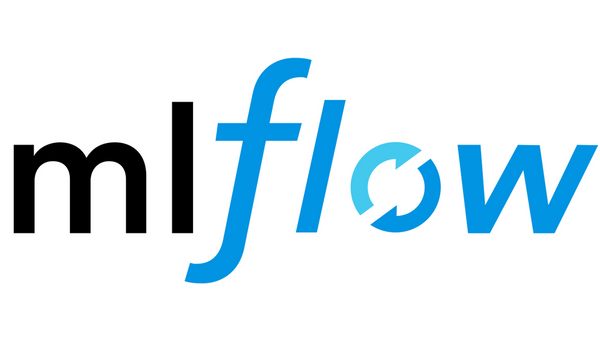
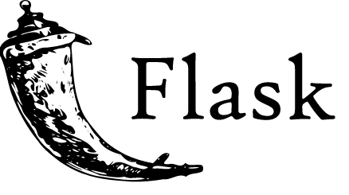

<h1 align="center">Part 4: Put it in production ☁️</h1>

> <p  align="center"><em>
>  Building data products is more than just putting code into production,<br>
>  it also includes DevOps and lifecycle management of live systems.
> </em></p>

|                   | Server (Hosted)      | Google GCP (Serverless) | Amazon AWS (Serverless) |
|-------------------|----------------------|-------------------------|-------------------------|
| **Concept**       | Manual control       | Abstraction of server   | Abstraction of server   |
| **Hardware**      | Single machine (EC2) | Scalable environment    | Scalable environment    |
| **Usage**         | SSH to the machine   | UI and command line     | UI                      |
| **API Endpoints** | Flask + Guicorn      | Flask + Cloud Functions | Flask + AWS Lambda      |
| **Container**     | Docker               | Kubernetes              | Elastic Container Server (ECS) |
| **Messaging**     | Apache Kafka         | PubSub                  | Kinesis                 |
| **Storage**       | Your hard drive      | Cloud Storage (GCS)     | S3 + Athena             |

# Saving & Laod models → [MLFlow](https://mlflow.org/)

- **Pickle**: Errors when your training environment (python 3.7) is different from your production environment (3.6)
- **MLflow**: Best
  
<p align="center"></p>

```python
import mlflow.sklearn
mlflow.sklearn.save_model(model, "models/logit_games_v1")
loaded = mlflow.sklearn.load_model("models/logit_games_v1")
loaded.predict_proba(x)
```

```python
import mlflow.keras
mlflow.keras.save_model(model, "models/keras_games_v1")
loaded = mlflow.keras.load_model("models/keras_games_v1")
loaded.evaluate(x, y, verbose = 0))
```


# Deploy model to an API → [Flask](https://flask.palletsprojects.com/)

<p align="center"></p>

- Flask models as web API,
- Gunicorn: A WSGI Server for putting API in production
- Heroku: Hosting, free but limited.

```python
import pandas as pd
import mlflow.sklearn
import flask

model_path = "models/logit_games_v1"
model  = mlflow.sklearn.load_model(model_path)

app = flask.Flask(__name__)

@app.route("/", methods=["GET","POST"])
def predict():
    data = {"success": False}
    params = flask.request.args

    if "G1" in params.keys(): 
        new_row = { "G1": params.get("G1"), "G2": params.get("G2"), 
                    "G3": params.get("G3"), "G4": params.get("G4"), 
                    "G5": params.get("G5"), "G6": params.get("G6"), 
                    "G7": params.get("G7"), "G8": params.get("G8"), 
                    "G9": params.get("G9"), "G10": params.get("G10") }

        new_x = pd.DataFrame.from_dict(new_row, orient = "index").transpose()                
        data["response"] = str(model.predict_proba(new_x)[0][1])
        data["success"] = True

    return flask.jsonify(data)

if __name__ == '__main__':
    app.run(host='0.0.0.0')
```
### Test API

```python
import requests

new_row = { "G1": 0, "G2": 0, "G3": 0, "G4": 0, "G5": 0,
            "G6": 0, "G7": 0, "G8": 0, "G9": 0, "G10": 1 }

result = requests.get("http://52.90.199.190:5000/", params=new_row)
print(result.json()['response'])
```


# Maintenance (model drift → retraining)

Fitting and serving your machine learning (ML) model is one thing, but what about keeping it in shape over time?


> ### Importante: Existen 2 tipos de datos
>
> |            | Predicciones de futuro | Prediccion de otra cosa |
> |------------|------------------------|-------------------------|
> | Etiquetado | Los datos son **autoetiquetados**, conforme avanza el tiempo dispondremos de más datos etiquetados. | Los datos son **etiquetados a mano**, normalemente por un experto. Disponemos de más datos si se etiquetan más. |
> | Ejemplos   | Predicción de bitcoin, prediccion de comportamiento de cliente,... | Detecctor de caras |
> | Reentrenar modelo | Podrá ser **automatico** periodicamente, o cuando el nuevo error de validcion empeore | No tenemos la certeza si nuestro modelo está empeorando. |

### Opción A: Reentrenar periodicamente → Scheduling jobs
- Cron & crontab
  - Linux utility for scheduling
  - Disavantage:  it runs on a single machine. (machines con go down)
- Apache Airflow
  - Is an open source Workflow tool from apache

  
  
### Opción B: Reentrenar solo cuando el nuevo error de validación emepore


### Referencias
- [Productionizing Machine Learning: From Deployment to Drift Detection](https://databricks.com/blog/2019/09/18/productionizing-machine-learning-from-deployment-to-drift-detection.html)
- [Incremental training](https://medium.com/vantageai/keeping-your-ml-model-in-shape-with-kafka-airflow-and-mlflow-143d20024ba6)
- [Designing an end-to-end Machine Learning Framework](https://medium.com/@awaiskaleem/designing-an-end-to-end-machine-learning-framework-using-databricks-mlflow-apache-airflow-and-aws-f5257806faf3)


---

## Create a web application
- intractive Front End
  - Dash (similar to Shiny)


# Data warehoses

This approach has worked well in the past, but it creates issues when building large-scale data science pipelines. Moving data in and out of a relational database can be a bottleneck for these types of workflows. One of the solutions to this bottleneck is to use vendor solutions that separate storage from compute, such as Snowflake or Delta Lake.
