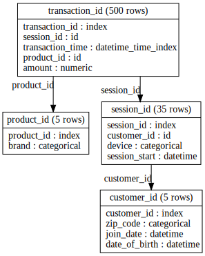
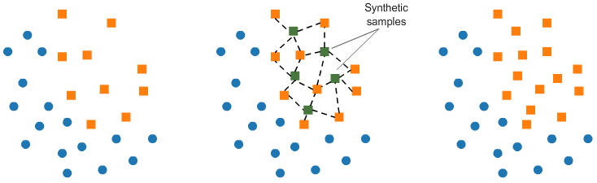
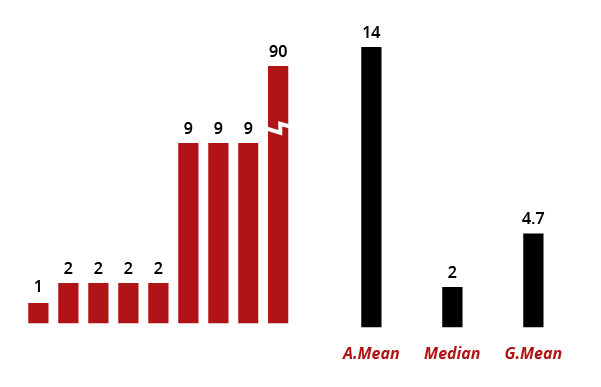
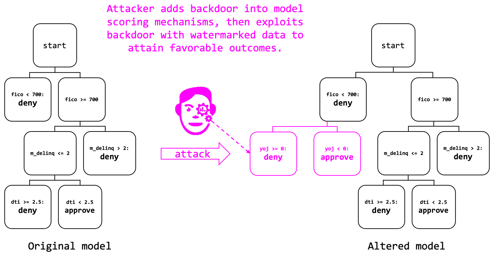

<h1 align="center">Machine Learning</h1>
<p align="center">My awesome personal Machine Learning notes.</p>
<p align="center"><a href="https://github.com/sindresorhus/awesome">
  
</a></p>


<h3 align="center">Part 1: <a href="#exploratory-data-analysis">Exploratory Data Analysis</a> 👁️</h3>

<table>
<tr><td>🐼</td><td><a href="#-pandas-">            <b>Pandas</b></a></td>              <td>The library for manage data.     </td>
    <td rowspan="7"></td></tr>
<tr><td>☝🏻</td><td><a href="#-univariate-analysis-"><b>Univariate analysis</b></a></td> <td>Plot each variable independently.</td></tr>
<tr><td>✌🏻</td><td><a href="#-univariate-analysis-"><b>Bivariate analysis</b></a></td>  <td>Plot variable pairs.             </td></tr>
<tr><td>❓</td><td><a href="#-missings-">           <b>Missings</b></a></td>            <td> Locate empty data.              </td></tr>
<tr><td>🔎</td><td><a href="#-outliers-">          <b>Outliers</b></a></td>            <td>Detect rare data.                </td></tr>
<tr><td>👯‍</td><td><a href="#-correlationn-">     <b>Correlation</b></a></td>         <td>Find similar variables.          </td></tr>
<tr><td>🌀</td><td><a href="#-dimensionality-reduction-"><b> Dimensionality reduction</b></a></td>  <td>See into 2 or 3 dimensions.</td></tr>
</table>   

<h3 align="center">Part 2: <a href="#prepare-the-data">Prepare the data</a> 🛠</h3>
  
<table>
<tr><td>🗃️</td><td><a href="#%EF%B8%8F-combine-tables-"><b>Combine tables</b></a></td>      <td>Merge tables by  forenig key.  </td>
    <td rowspan="6">        </td></tr>
<tr><td>➕</td><td><a href="#-feature-engineering-"><b>Feature engineering</b></a></td> <td>Create new features.       </td></tr>
<tr><td>➖</td><td><a href="#-feature-selection-">  <b>Feature selection</b></a></td>   <td>Drop usless features.      </td></tr>
<tr><td>✏️</td><td><a href="#-encoding-">          <b>Encoding</b></a></td>        <td>Encode variables & deal with missings.</td></tr>
<tr><td>✂</td><td><a href="#-split-data-">        <b>Split data</b></a></td>      <td>Define train and validation sets.   </td></tr>
<tr><td>📊</td><td><a href="#-imbalanced-data-">  <b>Imbalanced Data</b></a></td>  <td>Detect rare data.                   </td></tr>
</table>   


<h3 align="center">Part 3: Build the model ✨</h3>

|   |                                                                    |                                            |
|---|--------------------------------------------------------------------|--------------------------------------------|
| 🔮 | **Models**: [**Prediction**](#-prediction-models-), [**Clustering**](#-clustering-models-) | Select an appropriate model. |
| 🎯 |  [**Hyperparameter optimization (HPO)**](#-hyperparameters-optimization-) | Optimize model hyperparameters.      |
| 👪 |  [**Ensemble**](#-ensembles-) | Use several models. |
| 📏 |  **Metrics**: [**Classification**](#-Classification-metrics-), [**Regression**](#-Regression-metrics-) | Measure the model performance.  |
| 💭 | [**Interpretability (MLI)**](#-interpretability-)            | Explain your model decisions |
| 🍹 | [**Auto Machine learning**](#-auto-machine-learning-)        | Automatic machine learning pipeline        |


<h3 align="center">Part 4: Put it in production ☁️</h3>

|   |                                                                    |                                              |
|---|--------------------------------------------------------------------|----------------------------------------------|
| ⏫ | [**Model Deployment (API REST)**](#-model-deployment-)           | Deploy model as consumable software service. |
| 📋 | [**Model Monitoring (Logging)**](#-Monitoring-)                  | Log and detect errors.                        |
| ♻️ | [**Model Maintenance (Retraining)**](#-maintenance-)             | Retrain model on more recent data.            |
| 🔒 | [**Security**](#-security-)                                      | Secure your model and avoid hacking (attacks) |


----------------------------------------------------------------

<h3 align="center">Part 1</h3>
<h1 align="center">Exploratory Data Analysis</h1>


```python
# Put this on top of your notebook
import gc
import numpy             as np
import datatable         as dt
import pandas            as pd
import seaborn           as sb
import pandas_profiling  as pd_eda
import missingno         as msno
import matplotlib.pyplot as plt
import altair            as alt
from tqdm import tqdm_notebook as tqdm
```

# 🐼 Pandas [🔝](#machine-learning)
> - [**59 tricks in Pandas**](https://www.dataschool.io/python-pandas-tips-and-tricks/)
> - [**Kaggle learn Pandas**](https://www.kaggle.com/learn/pandas)

- Import pandas library `import pandas as pd`
- Read a CSV file into a pandas dataframe `df = pd.read_csv("file.csv")`
- Get dataframe info:
  - Show firt/last rows `df.head()` `df.tail()`
  - Get shape: `df.shape`. Get columns: `df.columns.tolist()`.
  - Print some info (like missings and types): `df.info()`
  - Has missings? `df.isnull().any().any()`
  - Describe numerical atributes `df.describe()`
  - Describe categorical atributes `df.describe(include=['object', 'bool'])`
- Do some data exploration
  - Get some column (return a series) `df["column"]`
  - Get some columns (return a df) `df[["column1", "column1"]]`
  - Apply function to column `.mean()` `.std()` `.median()` `.max()` `.min()` `.count()`
  - Count unique values `.value_counts()`
- Filter dataframe rows
  - One condition `df[df["column"]==1]`
  - Multiple conditions `df[(df["column1"]==1) & (df["column2"]=='No')]`
- Save it in a CSV [`df.to_csv("sub.csv", index=False)`](http://pandas.pydata.org/pandas-docs/stable/user_guide/io.html#io-store-in-csv)


### Obtain the data

```python
df = pd.read_csv("data.csv")
```

### Show and describe the data

```python
df.head()           # Show the first 5 rows
df.tail()           # Show the last 5 rows
df.sample(N)        # Show N random rows
df.dtypes           # Show features types
df.info()           # Show features types and missings
df.describe()       # Describe numeric features: count, mean, std, min, 25%, 50%, 75%, max
df.describe(include=['object', 'bool']) # Describe categoric features: count, unique, top, freq
df.profile_report() # Histograms, missings, correlations, etc (Pandas Profiling package)
```

### Optimize numeric variable types
```python
def reduce_mem_usage(df, verbose=True):
    start_mem = df.memory_usage().sum() / 1024**2
    numerics = ['int16', 'int32', 'int64', 'float16', 'float32', 'float64']

    for col in df.columns:
        col_type = df[col].dtypes
        if col_type in numerics:
            c_min = df[col].min()
            c_max = df[col].max()
            if str(col_type)[:3] == 'int':
                if      np.iinfo(np.int8).min<c_min and c_max<np.iinfo(np.int8).max:    df[col] = df[col].astype(np.int8)
                elif   np.iinfo(np.int16).min<c_min and c_max<np.iinfo(np.int16).max:   df[col] = df[col].astype(np.int16)
                elif   np.iinfo(np.int32).min<c_min and c_max<np.iinfo(np.int32).max:   df[col] = df[col].astype(np.int32)
                elif   np.iinfo(np.int64).min<c_min and c_max<np.iinfo(np.int64).max:   df[col] = df[col].astype(np.int64)  
            else:
                if   np.finfo(np.float16).min<c_min and c_max<np.finfo(np.float16).max: df[col] = df[col].astype(np.float16)
                elif np.finfo(np.float32).min<c_min and c_max<np.finfo(np.float32).max: df[col] = df[col].astype(np.float32)
                elif np.finfo(np.float64).min<c_min and c_max<np.finfo(np.float64).max: df[col] = df[col].astype(np.float64)

    end_mem = df.memory_usage().sum() / 1024**2
    if verbose: print('Mem. usage decreased to {:5.2f} Mb ({:.1f}% reduction)'.format(end_mem, 100*(start_mem-end_mem)/start_mem))
    return df
```


# ❓ Missing values [🔝](#machine-learning)

### Ploting missings

```python
# Option 1: Pandas
def check_missing(df):
    total = df.isnull().sum().sort_values(ascending=False)
    percent = (df.isnull().sum()/df.isnull().count()*100).sort_values(ascending=False)
    return pd.concat([total, percent], axis=1, keys=['Total', 'Percent missing'])

sns.heatmap(df.isnull(), cbar=False);  # Option 2: With Seaborn
msno.matrix(df);                       # Option 3: With missingno
```

# 🔎 Outlier Detection [🔝](#machine-learning)
  
- Standard Deviation
- Percentiles
- Isolation Forest: sklearn.ensemble.IsolationForest

> ## Handling Outliers
> - Remove
> - Change to max limit

#### Standard Deviation

```python
#Dropping the outlier rows with standard deviation
factor = 3
upper_lim = data['column'].mean () + data['column'].std () * factor
lower_lim = data['column'].mean () - data['column'].std () * factor

data = data[(data['column'] < upper_lim) & (data['column'] > lower_lim)]
```

#### Isolation Forest

```python
from sklearn.ensemble import IsolationForest

clf = IsolationForest(contamination=0.01, behaviour='new')
outliers = clf.fit_predict(df_x)
sns.scatterplot(df_x.var1, df_x.var2, outliers, palette='Set1', legend=False)
```


----------------------------------------------------------------

<h3 align="center">Part 2</h3>
<h1 align="center">Prepare the data</h1>

```python
# Put this on top of your notebook
import pandas            as pd
import featuretools      as ft
import category_encoders as ce
from sklearn.compose import ColumnTransformer
```


# 🗃️ Combine tables [🔝](#machine-learning)


If you have **several tables** or **1 table with many rows per entity** (user, product,...), you have to do deep feature synthesis with the **featuretools** library.
However, if you only have a regular table with single row per entity, then featuretools won’t be necessary.

Imagine you have **several tables**:

```python
tables = ft.demo.load_mock_customer()

customers_df    = tables["customers"]
sessions_df     = tables["sessions"]
transactions_df = tables["transactions"]
products_df     = tables["products"]
```

Therefore, you have **relations** between tables:

```python
entities = {
    "customers":    (customers_df,    "customer_id"),
    "sessions":     (sessions_df,     "session_id",     "session_start"),
    "transactions": (transactions_df, "transaction_id", "transaction_time"),
    "products":     (products_df,     "product_id")
}

relationships = [
#   (primary_entity, primary_key, foreing_entity, foreing_key)
    ("products", "product_id", "transactions", "product_id"),
    ("sessions", "session_id", "transactions", "session_id"),
    ("customers", "customer_id", "sessions", "customer_id")
]
```

Then you can create an **entity set**:

```python
es = ft.EntitySet("customer_data", entities, relationships)
es.plot()
```


Finally you can create the **final dataset on the target entity** (sessions for example), for doing Machine Learning:

```python
df, vars = ft.dfs(entities=entities, relationships=relationships, target_entity="sessions")
```


# ➕ Feature Engineering [🔝](#machine-learning)


## Numerical Features

```python
df["{} + {}"].format(var1, var2) = df[var1] + df[var2]
df["{} - {}"].format(var1, var2) = df[var1] - df[var2]
df["{} * {}"].format(var1, var2) = df[var1] * df[var2]
df["{} / {}"].format(var1, var2) = df[var1] / df[var2] # Precio del metro cuadrodo si tenemos metros y precio de la casa

df["log({})"].format(var1)    = np.log(df[var1])       # Good for skewed (not normal distribution) data
df["log2({})"].format(var1)   = 1+np.log(df[var1])       # Good for skewed (not normal distribution) data
df["root({})"].format(var1)   = np.root(df[var1])
df["root2({})"].format(var1)  = np.root(df[var1]+2/3)
df["square({})"].format(var1) = np.square(df[var1])
df["BoxCox({})"].format(var1) = # Box-Cox transform
#Binning:        Fixed-Width   (ej. age intervals) Good for uniform distributions
#Binning:        Adaptive (quantile based):     Good for skewed (not normal distribution) data
```

## Categorical Features

```python
df["latitud"]   = df["ciudad"].getLat()
df["longitud"]  = df["ciudad"].getLon()
df["poblacion"] = df["ciudad"].getPob()
df["pais"]      = df["ciudad"].getCou()  # Cluster (Paris->France)
```

## Date Features

```python
# Simple
def featEng_date(df, varName):
    df['year']         = df[varName].dt.year.astype(np.int16)
    df['month']        = df[varName].dt.month.astype(np.int8)
    df['week']         = df[varName].dt.weekofyear.astype(np.int8)
    df['day_of_year']  = df[varName].dt.dayofyear.astype(np.int16)
    df['day_of_month'] = df[varName].dt.day.astype(np.int8)
    df['day_of_week']  = df[varName].dt.dayofweek.astype(np.int8)
    df['hour']         = df[varName].dt.hour.astype(np.int8)
    df['minute']       = df[varName].dt.minute.astype(np.int8)
    df['is_weekend']   = # To do
    df['is_vavation']  = # To do

# Advanced: Agregregates
periods   = ["15T", "1H", "3H"]
agregates = ["count", "mean", "std", "min", "max", "sum", "median"]
```

> - [Tsfresh](https://tsfresh.readthedocs.io): Automatic calculates time series features
> - [Trane](https://github.com/HDI-Project/Trane)


# ➖ Feature Selection [🔝](#machine-learning)

> [Boruta-py](https://github.com/scikit-learn-contrib/boruta_py): all-relevant feature selection method (by scikit-learn contribution)
> - Read [this post on machinelearningmastery](https://machinelearningmastery.com/feature-selection-with-real-and-categorical-data/)
> - Read [sklearn chapter](https://scikit-learn.org/stable/modules/feature_selection.html)

Reduce number of attributes. See **feat importance**, **correlations**...

- Mutual information
- LASSO
- [**Feature selection**](https://scikit-learn.org/stable/modules/feature_selection.html)
- Wrapper: Su usa un classificador
  - MultiObjectiveEvolutionarySearch: Mejor para muchas generaciones. 10000 Evals
  - PSO: Particule Search optimization: Mejor para pocas generaciones.
  - RFE: Recursive feature elimination
  - SelectKBest
  - Variance Threshold
- Filters:
  - InfoGAIN: Cantidad de informacion
  - Correlation Featue Selection
  
#### Recursive Feature Elimination (RFE)   
At each iteration, select one feature to remove until there are n feature left*

```python
from sklearn.feature_selection import RFE
```

#### SelectKBest
The SelectKBest class just scores the features using a function and then removes all but the k highest scoring features.

```python
from sklearn.feature_selection import SelectKBest
```

#### Variance Threshold
Drop all features that dont meet a variance threshold

```python
from sklearn.feature_selection import VarianceThreshold
```


# 🛠 Encoding [🔝](#machine-learning)


[Categorical feats encoding in Trees](https://medium.com/data-design/visiting-categorical-features-and-encoding-in-decision-trees-53400fa65931)

<table>

  <tr>
    <tD></tD>
    <tD>
      <h4>Tree based models</h4>
      <ul>
        <li>Decission tree</li>
        <li>Random Forest</li>
        <li>Extra trees</li>
        <li>Adaboost</li>
        <li>Gradient Boosting</li>
        <li>XGBoost</li>
        <li>LightGBM</li>
        <li>CatBoost</li>
      </ul>
    </tD>
    <td>
      <h4>No-tree based models</h4>
      <ul>
        <li>Linear Models</li>
        <li>Neural Networks</li>
        <li>K-Nearest Neighbors</li>
        <li>Suport Vector Machines</li>
      </ul>
    </td>
  </tr>


  <tr>
    <th>Binary</th>
    <td>
      <ul>
        <li>Binary encoding (1 column)</li>
      </ul>
    </td>
    <td>
      <ul>
        <li>One hot encoding (2 columns)</li>
      </ul>
    </td>
  </tr>

  <tr>
    <th>Categorical<br>Ordinal</th>
    <td>
      <ul>
        <li>Ordinal encoding (less than 1000) ⭐</li>
        <li>Binary encoding (more than 1000)</li>
        <li>Frequency encoding</li>
      </ul>
    </td>
    <td>
      <ul>
        <li>One hot encoding (low card) ⭐</li>
        <li>Embedding (high card)</li>
      </ul>
    </td>
  </tr>


  <tr>
    <th>Numerical</th>
    <td>
      <ul>
        <li>Nothing ⭐</li>
      </ul>
    </td>
    <td>
      <ul>
        <li>StandarScaler ⭐</li>
        <li>MinMaxScaler</li>
        <li>RobustScaler</li>
      </ul>
    </td>
  </tr>
</table>


## TODO: Add NLP Features
- Split (name & surname)
- Bag of words
- tfidf
- n-grams
- word2vec
- topic extraction


## Automatic detect types (dangerous)

```python
# See data types: df.info()
numeric_vars      = df.select_dtypes(exclude=[object,'datetime64','timedelta64']).columns
categorical_vars  = df.select_dtypes(include=[object]).columns
time_vars         = df.select_dtypes(include=['datetime64','timedelta64']).columns

high_cardinality = [c for c in categorical_vars if len(X[c].unique()) > 16]
low_cardinality  = [c for c in categorical_vars if len(X[c].unique()) <= 16]

num_uniques = int(df[var].nunique())
embed_dim   = int(min(num_uniques // 2, 50)
```


## packages
- [Categorical-encoding](https://github.com/scikit-learn-contrib/categorical-encoding): Categorical variables encoding (by scikit-learn contribution)
- [FeatureHub](https://github.com/HDI-Project/FeatureHub): 
- TO DO: What is Latent feature discovery ??? 
 


## Dealing with missings

- **Remove**
  - **Rows** with missings
    - `df = df.loc[df.isnull().mean(axis=1) < 0.6]`
  - **Columns** with missings
    - If has 1 missing:                `df = df[df.columns[df.isnull().any()]`
    - If has 70% (o more) of missings: `df = df[df.columns[df.isnull().mean() < 0.7]]`
- **Imputation**:
  - **Univariate feature imputation**: By looking only the missing column (`SimpleImputer`)
    - **Numeric**: `mean` or `median`
    - **Categoric**: `most_frequent` or `constant`
    - But when **Time Series**: `interpolation`
  - **Bivariate feature imputation**: By looking other columns and train a predictor (`IterativeImputer`) ⭐

Tips:

> - **Tip 1: Imputation + missing indicator**:  Note that if you are using a data imputation technique, you can add an additional binary feature as a missing indicator. **GOOD PRACTICE**
> - **Tip 2**: Before you start working on the learning problem, you cannot tell which data imputation technique will work the best. Try several techniques, build several models and select the one that works the best.


## Univariate feature imputation

```python
######################################################################## Pandas
data = data.fillna(0)             # Filling all missing values with 0
data = data.fillna(data.median()) # Filling missing values with medians of the columns

######################################################################## Sklearn SimpleImputer
from sklearn.impute import SimpleImputer

imputer = SimpleImputer(strategy='mean', missing_values=np.nan,  add_indicator=False)
imputer = SimpleImputer(strategy='median')
imputer = SimpleImputer(strategy='most_frequent')
imputer = SimpleImputer(strategy='constant')

imputed_X_train = pd.DataFrame(imputer.fit_transform(X_train))
imputed_X_valid = pd.DataFrame(imputer.transform(X_valid))

# Imputation removed column names; put them back
imputed_X_train.columns = X_train.columns
imputed_X_valid.columns = X_valid.columns
```

## Bivariate feature imputation

The Iterative Imputer is developed by Scikit-Learn and models each feature with missing values as a function of other features. It uses that as an estimate for imputation. At each step, a feature is selected as output y and all other features are treated as inputs X. A regressor is then fitted on X and y and used to predict the missing values of y. This is done for each feature and repeated for several imputation rounds.

Let us take a look at an example. The data that I use is the well known Titanic dataset. In this dataset, the column Age has missing values that we would like to fill. The code, as always, is straightforward:

```python
from sklearn.experimental import enable_iterative_imputer  # explicitly require this experimental feature
from sklearn.impute import IterativeImputer
from sklearn.ensemble import RandomForestRegressor

# Load data
titanic = pd.read_csv("titanic.csv")
titanic = titanic.loc[:, ['Pclass', 'Age', 'SibSp', 'Parch', 'Fare']]

# Run imputer with a Random Forest estimator
imp = IterativeImputer(RandomForestRegressor(), max_iter=10, random_state=0)
titanic = pd.DataFrame(imp.fit_transform(titanic), columns=titanic.columns)
```

The great thing about this method is that it allows you to use an estimator of your choosing. I used a RandomForestRegressor to mimic the behavior of the frequently used missForest in R.

- **Additional tip 1**: If you have sufficient data, then it might be an attractive option to simply delete samples with missing data. However, keep in mind that it could create bias in your data. Perhaps the missing data follows a pattern that you miss out on.
- **Additional tip 2**: The Iterative Imputer allows for different estimators to be used. After some testing, I found out that you can even use Catboost as an estimator! Unfortunately, LightGBM and XGBoost do not work since their random state names differ.


### One-Hot Encoding
Some learning algorithms only work with numerical feature vectors. When some feature in your dataset is categorical, like “colors” or “days of the week,” you can transform such a categorical feature into several binary ones.


```python
## One Hot Encoding takes a single categorical feature and converts it
## into several dummy columns
from sklearn.preprocessing import OneHotEncoder
cat_encoder = OneHotEncoder()
my_hot_encoded_dummy_cols = OneHotEncoder.fit_transform(my_cat_feature)
```

```Python
# Binarizing
lb = preprocessing.LabelBinarizer()
lb.fit([1, 2, 6, 4, 2])
print(lb.transform((1,4)))
print(lb.classes_)
```


  - Scaling:        Normalization: Numerical to range=[0, 1]
  - Scaling:        Standardization: Numerical to (mean= 0, std=1)

### Normalization
Normalization is the process of converting an actual range of values which a numerical
feature can take, into a standard range of values, typically in the interval [−1, 1] or [0, 1].
For example, suppose the natural range of a particular feature is 350 to 1450. By subtracting 350 from every value of the feature, and dividing the result by 1100, one can normalize those values into the range [0, 1].
More generally, the normalization formula looks like this:

new_x = (x − min(x)) / max(x) − min(x)

### Standardization
Standardization is the procedure during which the feature values are rescaled so that they have the properties of a standard normal distribution with μ = 0 and σ = 1, where μ is the mean (the average value of the feature, averaged over all examples in the dataset) and σ is the standard deviation from the mean.
Standard scores (or z-scores) of features are calculated as follows:

new_x = x − mean / standard deviation


```python
## Standardization using pandas
df['var'] = ((df['var']-(df['var'].mean())))/(df['var'].std())
```

```Python
## Standard Scaler - you should always fit your scaler on training data,
## then apply it to the test data
scaler = StandardScaler().fit(X_train)
X_train_1 = scaler.transform(X_train)
X_test_1 = scaler.transform(X_test)
```


# 🌀 Dimensionality reduction [🔝](#machine-learning)
> - https://www.analyticsvidhya.com/blog/2018/08/dimensionality-reduction-techniques-python/
> - Read [Curse of dimensionality](https://en.wikipedia.org/wiki/Curse_of_dimensionality)
> - [Manifold learning](https://scikit-learn.org/stable/modules/manifold.html)
> - [Matrix factorization](https://scikit-learn.org/stable/modules/decomposition.html)

Method       | Name                                          | Based in                   | Duration
:-----------:|-----------------------------------------------|----------------------------|-----
**PCA**      | Principal Component Analysis                  | Linear (maximize variance) | Fast
**t-SNE**    | t Stochastic Neighbor Embedding               | Neighbors |
**LargeVis** | LargeVis                                      | Neighbors |
**ISOMAP**   | t Stochastic Neighbor Embedding               | Neighbors |
**UMAP**     | Uniform Manifold Approximation and Projection | Neighbors |
**AE**       | Autoencoder (2 or 3 at hidden layer)          | Neural    |
**VAE**      | Variational Autoencoder                       | Neural    |
**LSA**      | Latent Semantic Analysis                      |           |
**SVD**      | Singular Value decomposition                  | Linear?   |
**LDA**      | Linear Discriminant Analysis                  | Linear    |
**MDS**      | Multidimensional Scaling                      |           |

Why reduce dimensions?
- Remove multicollinearity
- Deal with the curse of dimensionality
- Remove redundant features
- Interpretation & Visualization
- Make computations easier
- Identify Outliers


#### Principal Component Analysis (PCA)
a statistical procedure that uses an orthogonal transformation to convert a set of observations of possibly correlated variables into a set of values of linearly uncorrelated variables called principal components. The first component is the most important one, followed by the second, then the third, and so on.

```python
from sklearn.decomposition import PCA

pca = PCA(n_components=2)
pca.fit(X)
```

#### T-SNE
Read [How to use t-SNE effectively](https://distill.pub/2016/misread-tsne)

```python
from sklearn.manifold import TSNE

tsne   = TSNE(random_state=0)
x_tsne = tsne.fit_transform(x)

# And plot it:
plt.scatter(x_tsne[:, 0], x_tsne[:, 1]);
```

#### Independent Component Analysis (ICA)
a statistical technique for revealing hidden factors that underlie sets of random variables, measurements, or signals.

#### Principal Component Regression (PCR)
a technique for analyzing multiple regression data that suffer from multicollinearity. The basic idea behind PCR is to calculate the principal components and then use some of these components as predictors in a linear regression model fitted using the typical least squares procedure.

#### Partial Least Squares Regression (PLSR)
PCR creates components to explain the observed variability in the predictor variables, without considering the response variable at all. On the other hand, PLSR does take the response variable into account, and therefore often leads to models that are able to fit the response variable with fewer components.

#### Sammon Mapping
an algorithm that maps a high-dimensional space to a space of lower dimensionality by trying to preserve the structure of inter-point distances in high-dimensional space in the lower-dimension projection. sometimes we have to ask the question “what non-linear transformation is optimal for some given dataset”. While PCA simply maximizes variance, sometimes we need to maximize some other measure that represents the degree to which complex structure is preserved by the transformation. Various such measures exist, and one of these defines the so-called Sammon Mapping. It is particularly suited for use in exploratory data analysis.

#### Multidimensional Scaling (MDS)
a means of visualizing the level of similarity of individual cases of a dataset.

#### Projection Pursuit
a type of statistical technique that involves finding the most “interesting” possible projections in multidimensional data. Often, projections which deviate more from a normal distribution are considered to be more interesting.

#### Linear Discriminant Analysis (LDA)
if you need a classification algorithm you should start with logistic regression. However, LR is traditionally limited to only two class classification problems. Now, if your problem involves more than two classes you should use LDA. LDA also works as a dimensionality reduction algorithm; it reduces the number of dimension from original to C — 1 number of features where C is the number of classes.

#### Mixture Discriminant Analysis (MDA) — It is an extension of linear discriminant analysis. Its a supervised method for classification that is based on mixture models.

#### Quadratic Discriminant Analysis (QDA)
Linear Discriminant Analysis can only learn linear boundaries, while Quadratic Discriminant Analysis is capable of learning quadratic boundaries (hence it is more flexible). Unlike LDA however, in QDA there is no assumption that the covariance of each of the classes is identical.

#### Flexible Discriminant Analysis (FDA)
a classification model based on a mixture of linear regression models, which uses optimal scoring to transform the response variable so that the data are in a better form for linear separation, and multiple adaptive regression splines to generate the discriminant surface.


# ✂ Split data [🔝](#machine-learning)

- Simple split
- Cross validation

### Simple split
Split data into x, y for training and testing
```python
from sklearn.model_selection import train_test_split
## make a train test split
X_train, X_test, y_train, y_test = train_test_split(X, y)
```

### Cross validation
Check: https://scikit-learn.org/stable/modules/cross_validation.html


# 📊 Imbalanced Data [🔝](#machine-learning)

> - [The 5 Most Useful Techniques to Handle Imbalanced Datasets](https://www.kdnuggets.com/2020/01/5-most-useful-techniques-handle-imbalanced-datasets.html)
> - [Kaggle kerel: Resampling strategies](https://www.kaggle.com/rafjaa/resampling-strategies-for-imbalanced-datasets)
> - [Imbalanced classification posts](https://machinelearningmastery.com/category/imbalanced-classification)
> - [Twit](https://twitter.com/JFPuget/status/1219265604407959554)
> - [Scikit-learn approach](https://scikit-learn.org/stable/modules/cross_validation.html#cross-validation-iterators-with-stratification-based-on-class-labels)
> - [Imbalanced-learn package](http://imbalanced-learn.org) 


- Solution **`FIX IT ON DATA`** (Resample on train data)
  - **Subsample majority class**. But you can lose important data.
    - **Random**: `from imblearn.under_sampling import RandomUnderSampler`
    - **Cluster Centroids**: `from imblearn.under_sampling import ClusterCentroids`
    - **Tomek links**: `from imblearn.under_sampling import TomekLinks`
  - **Oversample minority class**. But you can overfit.
    - **Random**: `from imblearn.over_sampling import RandomOverSampler`
    - **SMOTE** `from imblearn.over_sampling import SMOTE`
    - ADASYN
    - SMOTENC: SMOTE for also categorial vars.
  - **Combine both**
    - **Tomek links & SMOTE**: `from imblearn.combine import SMOTETomek`
- Solution **`FIX IT ON MODEL`**: Overweight the minirity classes (supportd by most SoTA models)
  - Neural nets: **Weighted loss function** `CrossEntropyLoss(weight=[…])`
- Solution **`FIX IT ON PREDICTIONS`**
  - Output probabilities, and tune rounding threshold. Using 0.5 with imbalanced data is just wrong in general.
  
### `FIX IT ON DATA`: Resample train data


### Tomek Links


### SMOTE



Synthetic Minority Oversampling Technique (SMOTE) is an oversampling technique used to increase the samples in a minority class. It generates new samples by looking at the feature space of the target and detecting nearest neighbors. Then, it simply selects similar samples and changes a column at a time randomly within the feature space of the neighboring samples.

The module to implement SMOTE can be found within the imbalanced-learn package. You can simply import the package and apply a fit_transform:

```python
from imblearn.over_sampling import SMOTE, ADASYN, SMOTENC

X_resampled, y_resampled = SMOTE(sampling_strategy='minority').fit_resample(X, y)
X_resampled, y_resampled = SMOTE(sampling_strategy={"Fraud":1000}).fit_resample(X, y)
X_resampled = pd.DataFrame(X_resampled, columns=X.columns)
```


As you can see the model successfully oversampled the target variable. There are several strategies that you can take when oversampling using SMOTE:

- 'minority': resample only the minority class;
- 'not minority': resample all classes but the minority class;
- 'not majority': resample all classes but the majority class;
- 'all': resample all classes;
- When dict, the keys correspond to the targeted classes. The values correspond to the desired number of samples for each targeted class.

I chose to use a dictionary to specify the extent to which I wanted to oversample my data.

**Additional tip 1**: If you have categorical variables in your dataset SMOTE is likely to create values for those variables that cannot happen. For example, if you have a variable called isMale, which could only take 0 or 1, then SMOTE might create 0.365 as a value.

Instead, you can use SMOTENC which takes into account the nature of categorical variables. This version is also available in the imbalanced-learnpackage.

**Additional tip 2**: Make sure to **oversample after creating the train/test split** so that you **only oversample the train data**. You typically do not want to test your model on synthetic data.


### How to oversample with (stratified) cross validation


```python
from sklearn.model_selection import StratifiedKFold
from imblearn.over_sampling import SMOTE

cv = StratifiedKFold(n_splits=5)
for train_idx, test_idx, in cv.split(X, y):
    X_train, y_train = X[train_idx], y[train_idx]
    X_test, y_test = X[test_idx], y[test_idx]
    X_train, y_train = SMOTE().fit_sample(X_train, y_train)
    ...
```

---


Put this on top of your notebook
```python
# Data libraries
import numpy       as np
import pandas      as pd
import sklearn     as skl
import xgboost     as xgb
import lightgbm    as lgb
import catboost    as cgb
import h2o.automl  as ml_auto
import yellowbrick as ml_vis
import eli5        as ml_exp
from tqdm import tqdm_notebook as tqdm
```

# 🔮 Prediction models [🔝](#machine-learning)
> [TODO read](https://towardsdatascience.com/ml-algorithms-one-sd-%CF%83-74bcb28fafb6)

- Linear Models:         [scikit-learn chapeter](https://scikit-learn.org/stable/modules/linear_model.html)
- Decision Tree:         [scikit-learn chapeter]( https://scikit-learn.org/stable/modules/tree.html)
- Support Vector Machine: [scikit-learn chapeter]( https://scikit-learn.org/stable/modules/svm.html)
- Ensemble methods:       [scikit-learn chapeter](https://scikit-learn.org/stable/modules/ensemble.html)

### 🔮❓ Interpretable Models
Simple models. Good for starting point (baseline), understand the data, and create surrogate models of blackbox models.

| Interpretable Model | Linear | Monotone | Interaction | Task       |    |
|---------------------|--------|----------|-------------|------------|----|
| Linear Regression   | Yes    | Yes      | No          | regr       | ⭐ |
| Logistic Regression | No     | Yes      | No          | class      |    |
| Decision Tree       | No     | Some     | Yes         | class,regr | ⭐ |
| Decision Rules      |        |          |             |            |    |
| RuleFit             | Yes    | No       | Yes         | class,regr |    |
| Naive Bayes         | No     | Yes      | No          | class      |    |
| K-Nearest Neighbors | No     | No       | No          | class,regr |    |

### 🔮📦 Black Box Models
Better models

| Model                   |   |
|-------------------------|---|
| Support Vector Machine  |   |
| Random forest           | ⭐ |
| Extra trees             |   |
| Adaboost                |   |
| Gradient boosting (GBM) | ⭐⭐⭐ |
| Neural Network          | ⭐⭐   |


---

## Linear Models

#### Generalized Linear Models (GLMs)
Target does not follow a Gaussian distribution. Wrap the lineal reg. with a function.
- Binary category: **Logistic regression** (add sigmoid) and **Probit regression**
- Many categories: **Multinomial logistic regression** and **Multinomial probit regression**
- ordinal data: **Ordered probit regression**
- Discrete count: **Poisson regression**
- Time to the occurrence of an event:
- Very skewed outcome with a few very high values (household income).
- Mixed Effects/Hierarchical GLM

The features interact:
- Adding interactions manually

Not linear:
- Feature tranformations (log, root, exp, ...)
- Feature categorization (new subfeatures)
- Generalized Additive Models (GAMs):
  Fit standard regression coefficients to dome variables and nonlinear spline functions to other variables.


#### Ordinary Least Squares Regression (OLSR)
A method in Linear Regression for estimating the unknown parameters by creating a model which will minimize the sum of the squared errors between the observed data and the predicted one (observed values and estimated values).

#### Linear Regression
used to estimate real values (cost of houses, number of calls, total sales etc.) based on continuous variable.

#### Logistic Regression
used to estimate discrete values ( Binary values like 0/1, yes/no, true/false) based on given set of independent variable

#### Stepwise Regression
adds features into your model one by one until it finds an optimal score for your feature set. Stepwise selection alternates between forward and backward, bringing in and removing variables that meet the criteria for entry or removal, until a stable set of variables is attained. Though, I haven’t seen too many articles about it and I heard couple of arguments that it doesn’t work.

#### Multivariate Adaptive Regression Splines (MARS)
a flexible regression method that searches for interactions and non-linear relationships that help maximize predictive accuracy. This algorithms is inherently nonlinear (meaning that you don’t need to adapt your model to nonlinear patterns in the data by manually adding model terms (squared terms, interaction effects)).

#### Locally Estimated Scatterplot Smoothing (LOESS)
a method for fitting a smooth curve between two variables, or fitting a smooth surface between an outcome and up to four predictor variables. The idea is that what if your data is not linearly distributed you can still apply the idea of regression. You can apply regression and it is called as locally weighted regression. You can apply LOESS when the relationship between independent and dependent variables is non-linear.

#### Quantile regression
???

## Regulated linear models (Penalized regression):
An extension made to linear models (typically regression methods) that penalizes models (penalty parameter) based on their complexity, favoring simpler models that are also better at generalizing.
- **L1** o **LASSO**: Least Absolute Shrinkage and Selection Operator. Good for feat selection
- **L2** o **RIDGE**: For robustness
- **Elastic Net**:
- **LARS**: Least-Angle Regression

#### Ridge Regression (L2 Regularization)
Its goal is to solve problems of data overfitting. A standard linear or polynomial regression model will fail in the case where there is high collinearity (the existence of near-linear relationships among the independent variables) among the feature variables. Ridge Regression adds a small squared bias factor to the variables. Such a squared bias factor pulls the feature variable coefficients away from this rigidness, introducing a small amount of bias into the model but greatly reducing the variance. The Ridge regression has one main disadvantage, it includes all n features in the final model.

#### LASSO Regression (L1 Regularization)
Least Absolute Shrinkage and Selection Operator (LASSO). In opposite to Ridge Regression, it only penalizes high coefficients. Lasso has the effect of forcing some coefficient estimates to be exactly zero when hyper parameter θ is sufficiently large. Therefore, one can say that Lasso performs variable selection producing models much easier to interpret than those produced by Ridge Regression.

```python
LogisticRegression(penalty='l1')
```

#### Elastic Net
Ccombines some characteristics from both lasso and ridge. Lasso will eliminate many features, while ridge will reduce the impact of features that are not important in predicting your y values. This algorithm reduces the impact of different features (like ridge) while not eliminating all of the features (like lasso).

#### Least-Angle Regression (LARS)
Similar to forward stepwise regression. At each step, it finds the predictor most correlated with the response. When multiple predictors having equal correlation exist, instead of continuing along the same predictor, it proceeds in a direction equiangular between the predictors.

# Decision Tree
  
|                       | CHAID | CART  | ID3   | C4.5  and C5.0 |
|-----------------------|-------|-------|-------|----------------|
| Year                  | 1980  | 1984  | 1986  | 1993           |
| Handle numeric (<,>)  | Yes   | Yes   | No    | Yes            |
| Handle categorical    | Yes   | No    | Yes   | Yes            |
| Handle missings       |       |       |       | Yes            |
| Non-binary branches   | No    | No    |       | Yes            |
| Handle classification | Yes   | Yes   |       | Yes            |
| Handle regressioon    | No    | Yes   |       |                |
| Split method (class)  | Chi-square | GINI index | Information Gain | Gain Ratio |
| In Sklearn            | No    | Yes   | No    | No             |
| In Chefboost          | Yes   | Yes   | Yes   | Yes (C4.5)     |
| Video theory          | [video](https://youtu.be/cu0ZdZNCbKo) | [video](https://youtu.be/NtQpKgkkdsQ) | [video](https://youtu.be/NF9Z3oECvaA) | [video](https://youtu.be/344jy4Stusg) |
| Video code (Chefboost) | [video](https://youtu.be/dcnFuS4QILg) | [video](https://youtu.be/CSApBetgukM) | [video](https://youtu.be/Z93qE5eb6eg) | [video](https://youtu.be/kjhQHmtDaAA) |

> #### Curiosidades
> - In decissiopn trees, there is **no need to normalize** data.
> - C4.5 en Weka se llama J48
> - C5.0 está patentado, por eso no se ve en las librerias.


#### Iterative Dichotomiser 3 (ID3)
builds a tree top-down. It starts at the root and choose an attribute that will be tested at each node. Each attribute is evaluated through some statistical means in order to detect which attribute splits the dataset the best. The best attribute becomes the root, with its attribute values branching out. Then the process continues with the rest of the attributes. Once an attribute is selected, it is not possible to backtrack.

#### C4.5 and C5.0 (different versions of a powerful approach)
C4.5, Quinlan’s next iteration is a newer version of ID3. The new features (versus ID3) are: (i) accepts both continuous and discrete features; (ii) handles incomplete data points; (iii) solves over-fitting problem by bottom-up technique usually known as “pruning”; and (iv) different weights can be applied the features that comprise the training data. C5.0, the most recent Quinlan iteration. This implementation is covered by patent and probably as a result, is rarely implemented (outside of commercial software packages).

#### Classification and Regression Tree (CART)
CART is used as an acronym for the term decision tree. In general, implementing CART is very similar to implementing the above C4.5. The one difference though is that CART constructs trees based on a numerical splitting criterion recursively applied to the data, while the C4.5 includes the intermediate step of constructing rule sets.

### Chi-squared Automatic Interaction Detection (CHAID)
an algorithm used for discovering relationships between a categorical response variable and other categorical predictor variables. It creates all possible cross tabulations for each categorical predictor until the best outcome is achieved and no further splitting can be performed. CHAID builds a predictive model, or tree, to help determine how variables best merge to explain the outcome in the given dependent variable. In CHAID analysis, nominal, ordinal, and continuous data can be used, where continuous predictors are split into categories with approximately equal number of observations. It is useful when looking for patterns in datasets with lots of categorical variables and is a convenient way of summarizing the data as the relationships can be easily visualized.

## Tree of models
https://github.com/scikit-learn/scikit-learn/pull/13732
- Quilan (M5)
- Wang (M5P)

#### M5
M5 combines a conventional decision tree with the possibility of linear regression functions at the nodes. Besides accuracy, it can take tasks with very high dimension — up to hundreds of attributes. M5 model tree is a decision tree learner for regression task, meaning that it is used to predict values of numerical response variable Y. While M5 tree employs the same approach with CART tree in choosing mean squared error as impurity function, it does not assign a constant to the leaf node but instead it fit a multivariate linear regression model.


## Decision Rules
- **OneR**: Learns rules from a single feature. OneR is characterized by its simplicity, interpretability and its use as a benchmark.
- **Sequential covering**: General procedure that iteratively learns rules and removes the data points that are covered by the new rule.
- **Bayesian Rule Lists**: Combine pre-mined frequent patterns into a decision list using Bayesian statistics.
- RIPPER
- M5Rules
- PART
- JRip
- FURIA (fuzzy)

## Association rule learning
Given a set of transactions, the goal is to find rules that will predict the occurrences of an item based on the occurrences of other items in the transactions.
- Apriori algorithm
- Eclat algorithm
- FP (Frequent Pattern) Growth

#### Apriori
has great significance in data mining. It is useful in mining frequent itemsets (a collection of one or more items) and relevant association rules. You usually use this algorithm on a database that has a large number of transactions. For example, the items customers buy at a supermarket. The Apriori algorithm reduces the number of candidates with the following principle: If an itemset is frequent, ALL of its subsets are frequent.

#### Eclat (Equivalence Class Transformation)
the biggest difference from the Apriori algorithm is that it uses Depth First Search instead of Breadth First Search. In the Apriori algorithm, the element based on the product (shopping cart items 1, 2, 3, 3, etc.) is used, but in Eclat algorithm, the transaction is passed on by the elements (Shopping Cart 100,200 etc.).

#### FP (Frequent Pattern) Growth
helps perform a market basket analysis on transaction data. Basically, it’s trying to identify sets of products that are frequently bought together. FP-Growth is preferred to Apriori because Apriori takes more execution time for repeated scanning of the transaction dataset to mine the frequent items.


## Instance based models:
Instance and distances based. Utility To guess missing feature data. Utility 2: For reduce or clean the dataset.

The closeness of two examples is given by a distance function.
- **Euclidean distance** is frequently used in practice.
- **Negative cosine similarity** is another popular choice.
- **Chebychev distance**
- **Mahalanobis distance**
- **Hamming distance**

Algorithms:
- **K Nearest Neighbors (KNN)**: Used in recommendation systems. k = 5, 10 or sqrt(Num samples).
- **Weighted KNN**: Closer samples are more imortant. Better than KNN.
- **Fuzzy KNN**: Sample pionts class labels are multiclass vetor (distance to class centroids).
- **Parzen**: Define a window size (with gaussian shape for ex.) and select those samples. (k would be variable).
- **Learning Vector Quantization (LVQ)**
- **Self-Organizing Map (SOM)**
- **Locally Weighted Learning (LWL)**


#### K-Nearest Neighbor (KNN)
can be used for both classification and regression problems. KNN stores all available cases and classifies new cases by a majority vote of its K neighbors. Predictions are made for a new data point by searching through the entire training set for the K most similar instances (the neighbors) and summarizing the output variable for those K instances. For regression problems, this might be the mean output variable, for classification problems this might be the mode (or most common) class value.

#### Learning Vector Quantization (LVQ)
A downside of K-Nearest Neighbors is that it hangs on to the entire training dataset. LVQ is an artificial neural network algorithm that allows you to choose how many training instances to hang onto and learns exactly what those instances should look like. If you discover that KNN gives good results on your dataset try using LVQ to reduce the memory requirements of storing the entire training dataset.

#### Self-Organizing Map (SOM)
an unsupervised deep learning model, mostly used for feature detection or dimensionality reduction. It outputs a 2D map for any number of indicators. SOM differ from other artificial neural networks as it apply competitive learning as opposed to error-correction learning (like backpropagation with gradient descent), and in the sense that they use a neighborhood function to preserve the topological properties of the input space.

#### Locally Weighted Learning (LWL)
The idea behind this algorithm is that instead of building a global model for the entire function space, for each point of interest we build a local model based on neighboring data of the query point. For this purpose, each data point becomes a weighting factor which expresses the influence of the data point for the prediction. Mainly, data points that are in the close neighborhood to the current query point are receiving a higher weight than data points which are far away.

## Bayesian models
- Naive Bayes
- Gaussian Naive Bayes
- Multinomial Naive Bayes
- Averaged One-Dependence Estimators (AODE)
- Bayesian Belief Network (BBN)
- Bayesian Network (BN)

#### Naive Bayes
assumes that the presence of a particular feature in a class is unrelated to the presence of any other feature (independence). Provides a way of calculating posterior probability P(c|x) from P(c), P(x) and P(x|c). Useful for very large data sets.

#### Gaussian Naive Bayes
assumes that the distribution of probability is Gaussian (normal). For continuous distributions, the Gaussian naive Bayes is the algorithm of choice.

#### Multinomial Naive Bayes
a specific instance of Naive Bayes where the P(Featurei|Class) follows multinomial distribution (word counts, probabilities, etc.). This is mostly used for document classification problem (whether a document belongs to the category of sports, politics, technology etc.). The features/predictors used by the classifier are the frequency of the words present in the document.

#### Averaged One-Dependence Estimators (AODE)
developed to address the attribute-independence problem of the naive Bayes classifier. AODE frequently develops considerably more accurate classifiers than naive Bayes with a small cost of a modest increase in the amount of computation.

#### Bayesian Belief Network (BBN)
a probabilistic graphical model (a type of statistical model) that represents a set of variables and their conditional dependencies via a directed acyclic graph (DAG). For example, a Bayesian network could represent the probabilistic relationships between diseases and symptoms. Given symptoms, the network can be used to compute the probabilities of the presence of various diseases. A BBN is a special type of diagram (called a directed graph) together with an associated set of probability tables.

#### Bayesian Network (BN)
the goal of Bayesian networks is to model conditional dependence, and therefore causation, by representing conditional dependence by edges in a directed graph. Using them, you can efficiently conduct inference on the random variables in the graph through the use of factors.

#### Hidden Markov models (HMM)
a class of probabilistic graphical model that give us the ability to predict a sequence of unknown (hidden) variables from a set of observed variables. For example, we can use it to predict the weather (hidden variable) based on the type of clothes that someone wears (observed). HMM can be viewed as a Bayes Net unrolled through time with observations made at a sequence of time steps being used to predict the best sequence of hidden states.

#### Conditional random fields (CRFs)
a classical machine learning model to train sequential models. It is a type of Discriminative classifier that model the decision boundary between the different classes. The difference between discriminative and generative models is that while discriminative models try to model conditional probability distribution, i.e., P(y|x), generative models try to model a joint probability distribution, i.e., P(x,y). Their underlying principle is that they apply Logistic Regression on sequential inputs. Hidden Markov Models share some similarities with CRFs, one in that they are also used for sequential inputs. CRFs are most used for NLP tasks.


## Support Vector Machines (SVM)
- with liear kernel
- with RBF kernel: Very good one

#### Dealing with Noise?: Hinge loss
To extend SVM to cases in which the data is not linearly separable, we introduce the hinge
loss function: max (0, 1 − yi (wxi − b)).

#### Dealing with non-linearity?: Kernel functions
Multiple kernel functions exist, the most widely used of which is the RBF kernel.


# 👪 Ensembles [🔝](#machine-learning)
> - Read [this post in medium](https://towardsdatascience.com/ensemble-methods-bagging-boosting-and-stacking-c9214a10a205)
> - Read [KAGGLE ENSEMBLING GUIDE](https://mlwave.com/kaggle-ensembling-guide)
> - Read [OOF Stacking vs Blending](https://www.quora.com/What-are-examples-of-blending-and-stacking-in-Machine-Learning)
> - Read [DESlib](https://github.com/scikit-learn-contrib/DESlib), a scikit-learn based library for ensembles.

### Simple ensembles (averaging)
Put model predictions together (columns), and for each sample (row) compute:
- **Mode** (aka majority vote): The most frequent value. Only for classification
- **Arithmetic mean** (aka mean or average):
- **Geometric mean** (aka gmean): Most robust to outliers than mean. ⭐ The best [read this](https://medium.com/@JLMC/understanding-three-simple-statistics-for-data-visualizations-2619dbb3677a)
- **Harmonic mean** (aka hmean):
- **Quadratic mean**
- **Weighted versions**
- **Rank versions**



### Stacking (meta model) 💪💪💪
aka Meta model or Super Learning)  ⭐ The best
- [READ THIS](https://mlfromscratch.com/model-stacking-explained)
- Usaully done with several DL models and the metamodels are catboost & xgboost and then average both.
- There is 3 types of stacking
  - **Holdout stacking**: (aka Blending) Holdout validation
  - **OOF Stacking**: The out-of-fold models predictions is used to generate the new data. ⭐⭐ (Andrés approach)

> - **Ensemble model selection** (Caruana): Greedy method to add o remove models of your ensemble.
  
### Homogeneous ensembles (decission trees) 🌳🌳🌳
- **Bagging** (Bootstrapped Aggregation): Models by subsampling the data.
  - **Random Forest**: Rows & atribs bagging + Decision tress [classifier](https://scikit-learn.org/stable/modules/generated/sklearn.ensemble.RandomForestClassifier.html), [regressor](https://scikit-learn.org/stable/modules/generated/sklearn.ensemble.RandomForestRegressor.html)
  - **Extra Trees**: [classifier](https://scikit-learn.org/stable/modules/generated/sklearn.ensemble.ExtraTreesClassifier.html), [regressor](https://scikit-learn.org/stable/modules/generated/sklearn.ensemble.ExtraTreesRegressor.html)
  - **Bagging meta-estimator**
- **Boosting**
  - **Adaboost**: Adaptative boosting
  - **Gradient Boosting (GBM)**: Works great with heterogeneous data and small datasets (unlike neural nets). [link1](http://explained.ai/gradient-boosting/index.html), [link2](https://medium.com/mlreview/gradient-boosting-from-scratch-1e317ae4587d), [link3](http://blog.kaggle.com/2017/01/23/a-kaggle-master-explains-gradient-boosting/)
    - [**XGBoost**](https://github.com/dmlc/xgboost)
    - [**LightGBM**](https://github.com/Microsoft/LightGBM)
    - [**CatBoost**](https://github.com/catboost/catboost)
    - **Scikit-learn**: [classifier](https://scikit-learn.org/stable/modules/generated/sklearn.ensemble.GradientBoostingClassifier.html), [regressor](https://scikit-learn.org/stable/modules/generated/sklearn.ensemble.GradientBoostingRegressor.html)


#### Random Forest
Random forests provide an improvement over bagged trees by way of a random small tweak that decorrelates the trees. As in bagging, we build a number forest of decision trees on bootstrapped training samples. But when building these decision trees, each time a split in a tree is considered, a random sample of m predictors is chosen as split candidates from the full set of p predictors. The split is allowed to use only one of those m predictors.

Ways to interpret feature impact:
- Partial Dependency Plot
- Permute a single feature
- Keep track of information gains due to each features
- Keep track of traffic that passes by each value.


#### Gradient boosting
- Works great with heterogeneous data and small datasets (unlike neural nets). [link1](http://explained.ai/gradient-boosting/index.html), [link2](https://medium.com/mlreview/gradient-boosting-from-scratch-1e317ae4587d), [link3](http://blog.kaggle.com/2017/01/23/a-kaggle-master-explains-gradient-boosting/)
- Tree depth from 3 to 6
- [**XGBoost**](https://github.com/dmlc/xgboost), [**LightGBM**](https://github.com/Microsoft/LightGBM), [**CatBoost**](https://github.com/catboost/catboost) 💪 **Scikit-learn**: [classifier](https://scikit-learn.org/stable/modules/generated/sklearn.ensemble.GradientBoostingClassifier.html), [regressor](https://scikit-learn.org/stable/modules/generated/sklearn.ensemble.GradientBoostingRegressor.html)


# 🔮 Clustering models [🔝](#machine-learning)
Separate data in groups, useful for labeling a dataset.
- Knowing K
  - **K-Means**
  - **k-Medians**
  - **Mean-Shift**
- Without knowing K
  - **DBSCAN**: Density-Based Spatial Clustering of Applications with Noise. 

Methods to determine best k:
- Elbow Method
- Gap Method - like elbow method, but comparing with uniform
- Silhouette Score - (b-a) / max(a,b) where:
  - a is inter cluster distance,
  - b is next-nearest cluster centroid

#### K-Means
K means goal is to partition X data points into K clusters where each data point is assigned to its closest cluster. The idea is to minimize the sum of all squared distances within a cluster, for all clusters. A completely differerent algorithm than KNN (don’t confuse the two!).

#### single-linkage clustering
one of several methods of hierarchical clustering. It is based on grouping clusters in bottom-up fashion. In single-linkage clustering, the similarity of two clusters is the similarity of their most similar members.

#### K-Medians
a variation of K means algorithm. The idea is that instead of calculating the mean for each cluster (in order to determine its centroid), we calculate the median.

#### Expectation Maximization (EM)
it works similarly to K means except for the fact that the data is assigned to each cluster with the weights being soft probabilities instead of distances. It has the advantage that the model becomes generative as we define the probability distribution for each model.

#### Hierarchical Clustering
does not partition the dataset into clusters in a single step. Instead it involves multiple steps which run from a single cluster containing all the data points to N clusters containing single data point.

#### Fuzzy clustering
a form of clustering in which each data point can belong to more than one cluster.

#### DBSCAN (Density-Based Spatial Clustering of Applications with Noise)
used to separate clusters of high density from clusters of low density. DBSCAN requires just two parameters: the minimum distance between two points and the minimum number of points to form a dense region. Meaning, it groups together points that are close to each other (usually Euclidean distance) and a minimum number of points.

#### OPTICS (Ordering Points to Identify Cluster Structure)
the idea behind it is similar to DBSCAN, but it addresses one of DBSCAN’s major weaknesses: the problem of detecting meaningful clusters in data of varying density.

#### Non negative matrix factorization (NMF)
a Linear-algebraic model that factors high-dimensional vectors into a low-dimensionality representation. Similar to Principal component analysis (PCA), NMF takes advantage of the fact that the vectors are non-negative. By factoring them into the lower-dimensional form, NMF forces the coefficients to also be non-negative.

#### Latent Dirichlet allocation (LDA)
a type of probabilistic model and an algorithm used to discover the topics that are present in a corpus. For example, if observations are words collected into documents, to obtain the cluster assignments, it needs two probability values: P( word | topics), the probability of a word given topics. And P( topics | documents), the probability of topics given documents. These values are calculated based on an initial random assignment. Then, you iterate them for each word in each document, to decide their topic assignment.

####Gaussian Mixture Model (GMM)
Its goal is to find a mixture of multi-dimensional Gaussian probability distributions that best model any input dataset. It can be used for finding clusters in the same way that k-means does. The idea is quite simple, find the parameters of the Gaussians that best explain our data. We assume that the data is normal and we want to find parameters that maximize the likelihood of observing these data.


  
### Time series analysis
- Time series: Sequence of values of some feature (obtained in constant time periods).
- Goal: Get the forecast (predict future values).


# 🎯 Hyperparameters optimization [🔝](#machine-learning)

> ### Reference
> - NIPS talk
>   - [slides](https://ml-course.github.io/ML-course/slides_pdf/AutoML%20-%20ODSC%20Tutorial.pdf)
>   - [video](https://www.youtube.com/watch?v=0eBR8a4MQ30)
> - [ICML talk](https://slideslive.com/38917532/greybox-bayesian-optimization-for-automl)
> - [Paper: Practical Multi-fidelity BO for Hyperparameter Tuning](https://arxiv.org/abs/1903.04703)

| Method    | Name                                                    | Type         | Stars   |
|------------|--------------------------------------------------------|--------------|---------|
| **GS**     | **Grid Search**                                        | Parallel     |         |
| **RS**     | **Random Search**                                      | Parallel     |         |
| **BO-GP**  | **Bayesian Optimization with Gaussian Processes**      | Sequential BO| ⭐      |
| **NM**     | **Nelder-Mead Algorithm**                              | ?            | ⭐⭐   |
| **TPE**    | **Tree of Parzen Estimators**                          | ?            | ⭐⭐⭐ |
| **HB**     | **HyperBand**                                          | ?            | ⭐⭐⭐ |
| **BOHB**   | **Bayesian Optimization and HyperBand**                | ?            | ⭐⭐⭐ |
|            | **Simulated Annealing**                                | ?            |         |
| **GD**     | **Gradient Descent**                                   | Sequential   |         |
| **PSO**    | **Particle Swarm optimization**                        | Evolutionary | ⭐      |
| **CMA-ES** | **Covariance Matrix Adaptation Evolutionary Etrategy** | Evolutionary |         |


### Hyperparameters Optimization For Theoreticals

- **Grid Search**: Brute-force
- **Random Search**: 
- **Bayesian Optimization**: Which surrogate?
  - BO with **Gaussian Processes**
  - BO with **Bayesian Linear Regression**
  - BO with **Bayesian Neural Networks**
  - BO with **Random Forests**
  - BO with **Boosting + quantile regression**
- **Tree of Parzen Estimators**
- **Population-based**:
  - **Genetic programming** (TPOT)
  - **Particle Swarm optimization** (PSO)
  - **Covarianc matrix Adaptation evolution** (CMA-ES)
- **Hyperparameter Gradient Descent**
- **Probabilistic Extrapolation of Learning Curves**: in order to do early stopping
- **Multi-fidelity optimization**:
  - What is it?:
    - Make training faster to evaluate sooner. (Subset of the data, fewer iterations or epochs)
    - Avoid unnecesary bad trainings (Early stopping)
  - **Successive halving**: Many models with tiny data fraction. Then pick up best and increase data. Similar to PSO
  - **HyperBand**: Imporvement of Successive halving.
  - **BOHB**: Combine Bayesian Optimization and Hyperband.

  
### Hyperparameters Optimization For Practitioners

- If you have access to multiple fidelities (make training faster and representative by some tricks):
  - **BOHP**:
    - Combines the advantages of TPE and HyperBand
    - Python package: `hpbandster` or `auto-sklearn`
- If you dont have access to multiple fidelities:
  - Low-dim continuous params: **BO-GP** (e.g. Spearmint)
  - High-dim, categorical, conditional: **SMAC** or **TPE**
  - Puerly continuous, budget >10x dimensionality: **CMA-ES**

  
  
### Packages
- [Sklearn](https://scikit-learn.org):             GS, RS
- [Optunity](https://optunity.readthedocs.io):     GS, RS, NM, PSO and TPE
- [Hyperopt](https://hyperopt.github.io/hyperopt): RS, TPE
- [Optuna](https://optuna.org)                     BO-GP
- GPyOpt:                                          BO-GP
- [BayesianOptimization](https://github.com/fmfn/BayesianOptimization): BO-GP
- [skopt](https://scikit-optimize.github.io): (Scikit-Optimize)

### Explanations
- Grid Search: Search over a discrete set of predefined hyperparameters values.
- Random Search: Provide a statistical distribution for each hyperparameter, for taking a random value.
- Gradient Descent: Optimize hyperparameters using gradient descent.
- Evolutionary: Uses evolutionary algorithms to search the space of possible hyperparameters.


# 📏 Classification Metrics [🔝](#machine-learning)

> - [Scikit-learn classification metrics](https://scikit-learn.org/stable/modules/classes.html#classification-metrics)
> - [H2O classification metric scores](http://docs.h2o.ai/driverless-ai/latest-stable/docs/userguide/scorers.html#classification)
> - [H2O classification metric plots](http://docs.h2o.ai/driverless-ai/latest-stable/docs/userguide/diagnosing.html#classification-metric-plots)

Check:
- Hinge loss (like in SVM)
- Square loss (like in ridge regression)
- Logistic loss or cross-entropy (like in logistic regression)
- Exponential loss (like in boosting)

| Score                         | Description                                  | Tip                          |
|-------------------------------|----------------------------------------------|------------------------------|
| [**Accuracy**](#accuracy)     | `# correctly predicted / # observations`     | Highly interpretable         |
| [**Precision**](#precision)   | `TP / TP + FP` = `TP / predicted possitives` |                              |
| [**Recall**](#recall)         | `TP / TP + FN` = `TP / actual possitives`    |                              |
| [**Fβ Score**](#fβ-Score)     | `(1+β²) * (Prec*Rec)/(β²*Prec+Rec)`          |                              |
| [**F05**](#f05-Score)         | `1.25 * (Prec*Rec)/(0.25*Prec+Rec)`          | Good when you want to give more weight to precision |
| [**F1**](#f1-Score)           | `2 * (Prec*Rec)/(Prec+Rec)`                  |                              |
| [**F2**](#f2-Score)           | `5 * (Prec*Rec)/(4*Prec+Rec)`                | Good when you want to give more weight to recall    |
| [**Dice**](#dice-Score)       |`2 * (Pred ∩ GT)/(Pred + GT)`                 |                              |
| [**Log loss**](#log-loss)     |                                              |                              |
| [**MCC**](#mcc)               | Matthews Correlation Coefficient             | Represents the confusion matrix. Good for imbalanced |
| [**AUC**](#auc)               | Area Under the roc Curve                     | Represent the ROC curve.      |
| [**AUCPR**](#aucpr)           | Area Under the precision-recall Curve        |                               |
| [**MACROAUC**](#macroauc)     | Macro average of Areas Under the roc Curves  | Good for imbalanced data      |


| Classification Metric Plots     |   |
|---------------------------------|---|
| **Confusion Matrix**            | ⭐ |
| **ROC Curve**                   | ⭐ |
| **Precision-Recall Curve**      |   |
| **Cumulative Gains**            |   |
| **Lift Chart**                  |   |
| **Kolmogorov-Smirnov Chart**    |   |

### Example
Dataset with 5 disease images and 20 normal images. If the model predicts all images to be normal, its accuracy is 80%, and F1-score of such a model is 0.88


# 📏 Regression Metrics [🔝](#machine-learning)

| Scores    | Full name                         | Tip
|-----------|-----------------------------------|--------------------------------------------
| **ME**    | Mean Error  (or Mean Bias Error)  | It could determine if the model has positive bias or negative bias.
| **MAE**   | Mean Absolute Error               | The most simple.
| **MSE**   | Mean Squared Error                | Penalice large errors more than MAE.
| **MSLE**  | Mean Squared Log Error            |
| **MPE**   | Mean Percent Error                | Use when target values are across different scales
| **MAPE**  | Mean Absolute Percent Error       | Use when target values are across different scales
| **SMAPE** | Symmetric Mean Abs Percent Error  | Use when target values close to 0
| **MSPE**  | Mean Squared Percent Error        |
| **RMSE**  | Root Mean Squared Error ⭐        | Proportional to MSE.
| **RMSLE** | Root Mean Squared Log Error       | Not penalize large differences when both values are large numbers.
| **RMSPE** | Root Mean Squared Percent Error   | Use when target values are across different scales
| **R2**    | R² (coefficient of determination) |

⚠️ Note that **Squared** errors are sensitive to **outliers** (bad) because penalizes large errors by a lot more.

### Regression Metric Plots
- Actual vs Predicted
- Residual Plot with LOESS curve
- Residual Histogram


# 💭 Interpretability [🔝](#machine-learning)
- [h2o blog](https://www.h2o.ai/blog/how-to-explain-a-model-with-h2o-driverless-ai)
- [h2o doc](http://docs.h2o.ai/driverless-ai/latest-stable/docs/userguide/interpreting.html)
- [**THE BOOK**](https://christophm.github.io/interpretable-ml-book)

Good for:
- Detect social bias
- Model debugging
- Regulation
- Trust, transparency, in ML

Methods:

- Part 1: Interpletable models
  - Decision tress
  - GLMs
- Part 2: Black-box models interpletability
  - LIME
  - Shapley values
  - Surrogate model

| Technique                                                |
|----------------------------------------------------------|
| 1. Global Shapley Feature Importance                     |
| 2. Global Original Feature Importance                    |
| 3. Partial Dependence                                    |
| 4. Global Surrogate Decision Tree                        |
| 5. Global Interpretable Model                            |
| 6. Local Shapley Feature Importance                      |
| 7. Local Linear Explanations                             |
| 8. Local Surrogate Tree Decision Path                    |
| 9. Original Feature Individual Conditional Exception ICE |
| 10. Local Original Feature Importance                    |


---


<h1 align="center">Part 4: Put it in production ☁️</h1>

> - https://towardsdatascience.com/@bgweber
> - https://github.com/bgweber/DS_Production

# ⏫ Model Deployment [🔝](#machine-learning)


# 🔒 Security [🔝](#machine-learning)

> Reference: [Secure Machine Learning Ideas](https://github.com/jphall663/secure_ML_ideas)

1. Data poisoning attacks
2. Backdoors and Watermark attacks
3. Surrogate Model Inversion attacks
4. Membership inference by surrogate model
5. Adversarial example attacks
6. Impersonation




---

# 🍹 Auto Machine learning [🔝](#machine-learning)
> - [**MLBox**](https://github.com/AxeldeRomblay/MLBox)
> - [**Auto Sklean**](https://github.com/automl/auto-sklearn)
> - [**TPOT**](https://github.com/EpistasisLab/tpot) ⭐
> - [**H20**](http://docs.h2o.ai/h2o/latest-stable/h2o-docs/automl.html) ⭐
> - Neural Architecture Search (NAS) for deep learning
>   - **DARTS**: Differentiable Architecture Search
>   - [**Uber Ludwig**](https://uber.github.io/ludwig/) ⭐
>   - [**Autokeras**](https://autokeras.com/)
> - References
>   - [Automl webpage](https://www.automl.org/automl)
>   - [Siraj video](https://youtu.be/jn-22XyKsgo)
>

### Neural Architecture Search (NAS)
- **DARTS**: Differentiable Architecture Search [*paper*](https://arxiv.org/abs/1806.09055), [DARTS in PyTorch](https://github.com/quark0/darts)
----------------------------------------------------------------


# 🌍 Real world applications [🔝](#machine-learning)
> - loss-given-default
> - probability of default
> - customer churn
> - campaign response
> - fraud detection
> - anti-money-laundering
> - predictive asset maintenance
> - References
>   - [link](https://www.knime.com/solutions)


# 🗞️ Data sources [🔝](#machine-learning)
- Files
  - CSV
  - Excel
  - Parquet (columnar storage file format of Hadoop)
  - Feather
  - Python datatable (.nff, .jay)
- No relational databases
  - MongoDB
  - Redis
- Relational Databases (SQL)
  - MySQL
- Big data
  - Hadoop (HDFS)
  - S3 (Amazon)
  - Azure Blob storage
  - Blue Data Tap
  - Google big query
  - Google cloud storage
  - kdb+
  - Minio
  - Snowflake
  
  


# 📊 Visualization [🔝](#machine-learning)
Libraries: [Matplotlib](https://matplotlib.org/) and [Seaborn](https://seaborn.pydata.org/)
> - [**Kaggle learn visualization**](https://www.kaggle.com/learn/data-visualization)
> - [**Python graph gallery**](https://python-graph-gallery.com)


#### [H2O available graphs](http://docs.h2o.ai/driverless-ai/latest-stable/docs/userguide/datasets.html#the-visualization-page):
- Correlated Scatterplot
- Spikey Histograms
- Skewed Histograms
- Varying Boxplots
- Heteroscedastic Boxplots
- Biplot (PCA points and arrows)
- Outliers
- Correlation Graph
- Parallel Coordinates Plot
- Radar Plot
- Data Heatmap
- Missing Values Heatmap
- Gaps Histogram

#### Types
- Univariate visualization
  - Histogram
  - Density plot
  - Box plot
  - Violin plot
- Bivariate visualization
- Multivariate visualization
  - Parallel coords
  - Radar chart


### Numerical data distribution
<table>
<tr>
    <td><a href="https://python-graph-gallery.com/histogram">
        </td>
    <td><a href="https://python-graph-gallery.com/density-plot">
        </td>
    <td><a href="https://python-graph-gallery.com/boxplot">
        </td>
    <td><a href="https://python-graph-gallery.com/violin-plot">
        </td>
</tr>
<tr>
    <td>Histogram</td>
    <td>Density plot</td>
    <td>Box plot</td>
    <td>Violin plot</td>
</tr>
<tr>
    <td>df.plot.hist()<br>sns.distplot()</td>
    <td>df.plot.kde()<br>sns.kdeplot()</td>
    <td>df.plot.box()<br>sns.boxplot()</td>
    <td>sns.violinplot()</td>
</tr>
</table>

### Comparing numerical features
<table>
<tr>
<td></td>
<td></td>
<td></td>
<td></td>
<td></td>
<td></td>
</tr>
<tr>
<td>Scatter plot</td>
<td>Line plot</td>
<td>Bubble plot</td>
<td>Heatmap</td>
<td>Density plot 2D</td>
<td>Correlogram</td>
</tr>
<tr>
<td>df.plot.scatter()<br>plt.scatter()<br>sns.scatterplot()</td>
<td></td>
<td></td>
<td>plt.imshow(np)<br>sns.heatmap(df)
</td>
<td>df.plot.hexbin()</td>
<td>scatter_matrix(df)<br>sns.pairplot()</td>
</tr>
</table>


### Ranking
<table>
<tr>
<td></td>
<td></td>
<td></td>
<td></td>
<td></td>
</tr>
<tr>
<td>Bar plot</td>
<td>Lollipop plot</td>
<td>Parallel coords.</td>
<td>Radar chart</td>
<td>Word cloud</td>
</tr>
<tr>
<td>plt.scatter()<br>sns.scatterplot()</td>
<td></td>
<td>parallel_coordinates(df, 'cls')</td>
<td></td>
<td></td>
</tr>
</table>

### Part of a whole

<table>
<tr>
<td></td>
<td></td>
<td></td>
<td></td>
<td></td>
<td></td>
</tr>
<tr>
<td>Stacked bar plot</td>
<td>Pie chart</td>
<td>Donut chart</td>
<td>Dendrogram</td>
<td>Treemap</td>
<td>Venn diagram</td>
</tr>
</table>


### Evolution

<table>
<tr>
<td></td>
<td></td>
<td></td>
<td></td>
</tr>
<tr>
<td>Line chart</td>
<td>Area chart</td>
<td>Stacked area chart</td>
<td>Stream graph</td>
</tr>
</table>

 
---

# Others TODO:
- [Gaussian mixture models](https://scikit-learn.org/stable/modules/mixture.html)
- Prueba U de Mann-Whitney
- Prueba t de Student
- Metrica Kappa
- Self Organizing Map
- Restricted boltzmann machine: Como el autoencoder pero va y vuelve
- Competitive learning
- Hebbian learning
- Evolutionary algorithms
  - Check [Platypus](https://platypus.readthedocs.io/en/latest/index.html)


# Free resources

### [BEST COURSE](https://mlcourse.ai)
### [2nd BEST COURSE](https://ml-course.github.io/ML-course)
  
- Competitions
  - [**Kaggle competitions**](https://www.kaggle.com/competitions): Participating in competitions is a great way to test your knowledge.
  - [**Kaggle kernels**](https://www.kaggle.com/kernels): For each competition you have kernels (code notebooks) to code and learn.
  - [**Kaggle discussion**](https://www.kaggle.com/discussion): For each competition you have discussions (forums) to read and learn.
- Courses
  - [**Kaggle course**](https://www.kaggle.com/learn): Practical micro-courses provided by Kaggle. (Level: easy)
  - [**Fast.ai ML course**](http://course18.fast.ai/ml): Course by Jeremy Howard, a DL teacher. (Level: easy)
  - [**SaturdaysAI ML**](https://github.com/SaturdaysAI/Itinerario_MachineLearning)
- Blogs
  - [**FastML**](http://fastml.com)
  - [**ML overview**](https://vas3k.com/blog/machine_learning/): (Level: easy)
  - [**Maël Fabien blog**](https://maelfabien.github.io/blog/): (Level: medium)
- Libraries documentation
  - [**Scikit-learn documentation**](https://scikit-learn.org/stable/user_guide.html): (Level: hard)
  - [**H2o driverless documentation**](http://docs.h2o.ai/driverless-ai/latest-stable/docs/userguide/index.html): (Level: medium)
- Books
  - [**The hundred-page machine learning book**](http://themlbook.com/): (Level: medium) (This resource is not free)
  - [**Interpretable Machine Learning**](https://christophm.github.io/interpretable-ml-book): (Level: medium)
  - [**The elements of statistical learning**](https://web.stanford.edu/~hastie/ElemStatLearn/): (Level: hard)


## TODO: 
- [**Data Visualization**](https://medium.com/@alark/we-need-more-interactive-data-visualization-tools-for-the-web-in-python-ad80ec3f440e) (Winner: Altair)
  - [Slides](https://speakerdeck.com/jakevdp/altair-tutorial-intro-pycon-2018)
  - [Post](https://vallandingham.me/altair_intro.html)
  - [Notebooks](https://github.com/altair-viz/altair-tutorial/blob/master/notebooks/Index.ipynb)
  - [Video](https://www.youtube.com/watch?v=ms29ZPUKxbU)
  - [Documentation](https://altair-viz.github.io/)
  - [Vega-embed](https://github.com/vega/vega-embed) (for frontend)
- **Bayesian statistics**:
  - [introduction to bayes the theorem](https://www.analyticsvidhya.com/blog/2019/06/introduction-powerful-bayes-theorem-data-science)
  - [video: Bayesian Statistics](https://youtu.be/Oo-OrePF2dc)
  - [video: Bayesian Statistics with PyMC3](https://youtu.be/Bv92hl-z4yM)
  - Packages:
    - Stan: Bayesian modeling
    - PyMC3: Probabilistic programming
    - ArviZ, Help us interpret and visualize posterior distributions of PyMC3
- **Gaussian Process**
  - [GP, not quite for dummies](https://yugeten.github.io/posts/2019/09/GP)
  - [Distill: visual exploration](https://distill.pub/2019/visual-exploration-gaussian-processes)
- Gaussian mixture
- [Dataframe databases comparison](https://h2oai.github.io/db-benchmark/)
- **Feature engineering**
  - [4 Tips for Advanced Feature Engineering and Preprocessing](https://www.kdnuggets.com/2019/08/4-tips-advanced-feature-engineering-preprocessing.html)
  - [Encode categorical smarter](https://blog.featurelabs.com/encode-smarter)
  - [Feature engineering for ML](https://towardsdatascience.com/feature-engineering-for-machine-learning-3a5e293a5114)
- **Vowpal Wabbit**:
  - [mlcourse.ai video (Lecture 8. Part 2)](https://www.youtube.com/watch?v=gyCjancgR9U)
  - [Vowpal Wabbit tutorial for the Uninitiated](https://www.zinkov.com/posts/2013-08-13-vowpal-tutorial)
  - [Don’t be tricked by the Hashing Trick](https://booking.ai/dont-be-tricked-by-the-hashing-trick-192a6aae3087)
