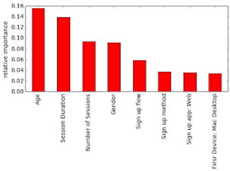

<table>
  <tbody>
    <tr>
      <td></td>
      <td>
        <h2>1. Exploratory data analysis with Pandas</h2>
        <ul>
          <li><a href="https://youtu.be/fwWCw_cE5aI">Video</a>: In the 1st lecture we get used to Pandas to perform preliminary data analysis.</li>
          <li><a href="https://mlcourse.ai/notebooks/blob/master/jupyter_english/topic01_pandas_data_analysis/topic1_pandas_data_analysis.ipynb?flush_cache=true">Notebook</a></li>
          <li><a href="https://www.kaggle.com/kashnitsky/a1-demo-pandas-and-uci-adult-dataset">Assignment</a>
          --><a href="https://www.kaggle.com/kashnitsky/a1-demo-pandas-and-uci-adult-dataset-solution">Solution</a></li>
        </ul>
      </td>
    </tr>
    <tr>
      <td></td>
      <td>
        <h2>2. Visualization, main plots for EDA</h2>
        <ul>
          <li><a href="https://youtu.be/WNoQTNOME5g">Video</a>: In the 2nd lecture, we discuss what typical plots are typically built when performing Exploratory Data Analysis.</li>
          <li><a href="https://nbviewer.jupyter.org/github/Yorko/mlcourse_open/blob/master/jupyter_english/topic02_visual_data_analysis/topic2_visual_data_analysis.ipynb?flush_cache=true">Notebook 1</a>: From Simple Distributions to Dimensionality Reduction</li>
          <li><a href="https://nbviewer.jupyter.org/github/Yorko/mlcourse_open/blob/master/jupyter_english/topic02_visual_data_analysis/topic2_additional_seaborn_matplotlib_plotly.ipynb?flush_cache=true">Notebook 2</a>: Overview of Seaborn, Matplotlib and Plotly libraries</li>
          <li><a href="https://www.kaggle.com/kashnitsky/a2-demo-analyzing-cardiovascular-data">Assignment</a>
           --><a href="https://www.kaggle.com/kashnitsky/a2-demo-analyzing-cardiovascular-data-solution">Solution</a> (Analyzing cardiovascular disease data)</li>
        </ul>
      </td>
    </tr>
    <tr>
      <td></td>
      <td>
        <h2>3. Decision trees and KNN</h2>
        <ul>
          <li><a href="https://youtu.be/H4XlBTPv5rQ">Video (theo)</a>: Here we start with basics of Machine Learning, then supervised learning, and cover classification decision trees in detail.</li>
          <li><a href="https://youtu.be/RrVYO6Td9Js">Video (prac)</a>: Here we use Sklearn to train, tune and visualize decision trees.</li>
          <li><a href="https://mlcourse.ai/notebooks/blob/master/jupyter_english/topic01_pandas_data_analysis/topic1_pandas_data_analysis.ipynb?flush_cache=true">Notebook</a></li>
          <li><a href="https://www.kaggle.com/kashnitsky/a3-demo-decision-trees">Assignment</a>
          --><a href="https://www.kaggle.com/kashnitsky/a3-demo-decision-trees-solution">Solution</a></li>
        </ul>
      </td>
    </tr>
    <tr>
      <td></td>
      <td>
        <h2>4. Linear Classification and Regression</h2>
        <ul>
          <li><a href="https://youtu.be/l3jiw-N544s">Video (theo)</a>: Mathematical foundations of  Logistic regression.</li>
          <li><a href="https://youtu.be/RrVYO6Td9Js">Video (prac)</a>: Alice competition with logistic regression.</li>
          <li><a href="https://nbviewer.jupyter.org/github/Yorko/mlcourse_open/blob/master/jupyter_english/topic04_linear_models/topic4_linear_models_part1_mse_likelihood_bias_variance.ipynb?flush_cache=true">Notebook 1</a>: Ordinary Least Squares</li>
          <li><a href="https://nbviewer.jupyter.org/github/Yorko/mlcourse_open/blob/master/jupyter_english/topic04_linear_models/topic4_linear_models_part2_logit_likelihood_learning.ipynb?flush_cache=true">Notebook 2</a>: Logistic Regression</li>
          <li><a href="https://nbviewer.jupyter.org/github/Yorko/mlcourse_open/blob/master/jupyter_english/topic04_linear_models/topic4_linear_models_part3_regul_example.ipynb?flush-cache=true">Notebook 3</a>: Regularization</li>
          <li><a href="https://nbviewer.jupyter.org/github/Yorko/mlcourse_open/blob/master/jupyter_english/topic04_linear_models/topic4_linear_models_part4_good_bad_logit_movie_reviews_XOR.ipynb?flush_cache=true">Notebook 4</a>: Pros and Cons</li>
          <li><a href="https://nbviewer.jupyter.org/github/Yorko/mlcourse_open/blob/master/jupyter_english/topic04_linear_models/topic4_linear_models_part5_valid_learning_curves.ipynb?flush_cache=true">Notebook 5</a>: Validation and learning curves</li>
        </ul>
      </td>
    </tr>
    <tr>
      <td></td>
      <td>
        <h2>5. Ensembles of algorithms and random forest</h2>
        <ul>
          <li><a href="https://youtu.be/neXJL-AqI_c">Video (theo)</a>: Ensembles and Random Forest.</li>
          <li><a href="https://youtu.be/aBOMYqGUlWQ">Video (theo)</a>: Classification metrics.</li>
          <li><a href="https://youtu.be/FmKU-1LZGoE">Video (prac)</a>: Business task: predicting paying users.</li>
          <li><a href="">Notebook 1</a>: Bagging</li>
          <li><a href="">Notebook 2</a>: Random Forest</li>
          <li><a href="">Notebook 3</a>: Feature importance</li>
        </ul>
      </td>
    </tr>
    <tr>
      <td></td>
      <td>
        <h2>6. Feature engineering and feature selection</h2>
      </td>
    </tr>
    <tr>
      <td></td>
      <td>
        <h2>7. Unsupervised learning</h2>
      </td>
    </tr>
    <tr>
      <td></td>
      <td>
        <h2>8. Vowpal Wabbit: Learning with Gigabytes of Data</h2>
      </td>
    </tr>
    <tr>
      <td></td>
      <td>
        <h2>9. Time series analysis in Python</h2>
        <ul>
          <li>Part 1. Basics</li>
          <li>Part 2. Predicting the future with Facebook Prophet</li>
        </ul>
      </td>
    </tr>
    <tr>
      <td></td>
      <td>
        <h2>10. Gradient Boosting</h2>
      </td>
    </tr>
  </tbody>
</table>
